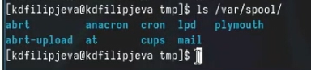

---
## Front matter
title: "Отчет о выполнении лабораторной работы"
subtitle: "Лабораторная работа №6"
author: "Филипьева Ксения Дмитриевна"

## Generic otions
lang: ru-RU
toc-title: "Содержание"

## Bibliography
bibliography: bib/cite.bib
csl: pandoc/csl/gost-r-7-0-5-2008-numeric.csl

## Pdf output format
toc: true # Table of contents
toc-depth: 2
lof: true # List of figures
lot: true # List of tables
fontsize: 12pt
linestretch: 1.3
papersize: a4
documentclass: scrreprt
## I18n polyglossia
polyglossia-lang:
  name: russian
  options:
	- spelling=modern
	- babelshorthands=true
polyglossia-otherlangs:
  name: english
## I18n babel
babel-lang: russian
babel-otherlangs: english
## Fonts
mainfont: PT Serif
romanfont: PT Serif
sansfont: PT Sans
monofont: PT Mono
mainfontoptions: Ligatures=TeX
romanfontoptions: Ligatures=TeX
sansfontoptions: Ligatures=TeX,Scale=MatchLowercase
monofontoptions: Scale=MatchLowercase,Scale=0.9
## Biblatex
biblatex: true
biblio-style: "gost-numeric"
biblatexoptions:
  - parentracker=true
  - backend=biber
  - hyperref=auto
  - language=auto
  - autolang=other*
  - citestyle=gost-numeric
## Pandoc-crossref LaTeX customization
figureTitle: "Рис."
tableTitle: "Таблица"
listingTitle: "Листинг"
lofTitle: "Список иллюстраций"
lotTitle: "Список таблиц"
lolTitle: "Листинги"
## Misc options
indent: true
header-includes:
  - \usepackage{indentfirst}
  - \usepackage{float} # keep figures where there are in the text
  - \floatplacement{figure}{H} # keep figures where there are in the text
---

# Цель работы

Приобретение практических навыков взаимодействия пользователя с системой посредством командной строки.

# Задание

Попрактиковать использование частых команд взаимодействия пользователя с ОС. Узнать и рассказать подробности о них.

# Теоретическое введение

В операционной системе типа Linux взаимодействие пользователя с системой обычно осуществляется с помощью командной строки посредством построчного ввода команд. При этом обычно используется командные интерпретаторы языка shell: /bin/sh; /bin/csh; /bin/ksh.

# Выполнение лабораторной работы

Узнаем путь до директории, в которой мы находимся. После этого перейдем в каталог tmp (рис. @fig:1).

{#fig:1 width=100%}

Введем команду ls с опцией -а, которая покажет нам файлы в каталоге tmp, в том числе и скрытые (рис. @fig:2).

{#fig:2 width=100%}

Введем команду ls с опцией -l, которая покажет наши файлы в развернутом формате, где видно кто создал их, когда, сколько занимают по весу и прочее (рис. @fig:3).

{#fig:3 width=100%}

Введем команду ls с опцией -F, которая покажет нам, какого типа файлы, находящиеся в каталоге. (рис. @fig:4).

{#fig:4 width=100%}

Введем одновременно все три опции(-alF) и посмотрим что выведет в консоли (рис. @fig:5).

{#fig:5 width=100%}

Было попрошено проверить, есть ли в директории /var/spool/ каталог cron - он там имеется (рис. @fig:6).

{#fig:6 width=100%}

Вернемся в домашний каталог и выведем более подробную информацию о файлах, где будет видно, что все они созданым мной (рис. @fig:7).

{#fig:7 width=100%}

Создадим папку newdir, а после внутри нее папку morefun (рис. @fig:8).

{#fig:8 width=100%}

Создадим одной командой сразу три каталога, а после, также одной командой, удалим их (рис. @fig:9).

{#fig:9 width=100%}

Попробуем удалить каталог newdir командой rm, но получим отказ, т.к. без указания опций она служит для удаления файлов, а не каталогов. После, используя команду rmdir удалим подкаталог morefun, а после убедимся, что удаление прошло успешно (рис. @fig:10).

{#fig:10 width=100%}

Используя команду man узнаем какая опция команды ls служит для того, чтобы вывести рекурсивно содержимое каталога (рис. @fig:11).

{#fig:11 width=100%}

Используя команду man узнаем, что для того, чтобы вывести файлы с сортировкой по времени последнего изменения (рис. @fig:12)(рис. @fig:13).

{#fig:12 width=100%}

{#fig:13 width=100%}

Опции для команды cd: 
- cd <dir> - перейти в указанный каталог
- cd .. - перейти на уровень выше
- cd ~ - перейти в домашний каталог пользователя
(рис. @fig:14).

{#fig:14 width=100%}

Опции для команды pwd:
как таковых их тут нет, поскольку команда чаще всего используется без опций, просто для вывода пути до директории, в которой мы находимся

(рис. @fig:15)

{#fig:15 width=100%}

Опции для команды mkdir:
- mkdir <directory> - создать каталог с указанным именем
- mkdir -p <directory> - создать каталоги в указанном пути, включая промежуточные

(рис. @fig:16)

{#fig:16 width=100%}

Опции для команды rmdir:
- rmdir <directory> - удалить указанный каталог

(рис. @fig:17).

{#fig:17 width=100%}

Опции для команды rm:
- rm <file> - удалить указанный файл
- rm -r <directory> - удалить каталог со всем его содержимым (рекурсивно)
- rm -f <file> - удалить файл без подтверждения
- rm -i <file> - запросить подтверждение перед удалением каждого файла

(рис. @fig:18).

{#fig:18 width=100%}

Отредактируем ранее использованные нами команды, с помощью команды history. (рис. @fig:19).

{#fig:19 width=100%}

# Выводы

Мы освоили частые команды пользователя на практике, а также узнали о их опциях более подробно.

# Ответы на контрольные вопросы

1. Командная строка - это интерфейс, предоставляющий пользователю возможность взаимодействия с операционной системой путем ввода текстовых команд.

2. Для определения абсолютного пути текущего каталога используется команда "pwd". Например, при вводе "pwd" в командной строке будет выведен абсолютный путь текущего каталога.

3. Для определения только типов файлов и их имен в текущем каталоге можно использовать команду "ls -l". Например, "ls -l" покажет типы файлов и их имена.

4. Для отображения информации о скрытых файлах используется опция "-a" с командой "ls". Например, "ls -a" отобразит скрытые файлы.

5. Для удаления файла используется команда "rm", а для удаления каталога - команда "rm -r". Нельзя удалить файл и каталог одной и той же командой. Например, "rm file.txt" удаляет файл, а "rm -r directory" - удаляет каталог.

6. Информацию о последних выполненных командах можно увидеть, нажав клавишу "Ctrl + R" и начав вводить символы команды.

7. Для выполнения измененной команды из истории команд можно использовать клавишу вверх или команду "!!". Например, "!!" выполнит последнюю команду из истории.

8. Примеры запуска нескольких команд в одной строке: "ls -l; pwd" или "mkdir folder; cd folder".

9. Символ экранирования "\" используется для игнорирования специального значения символа. Например, "\$": это позволяет вывести символ "$" без его специальной функции в команде.

10. При использовании команды "ls -l" на экране отобразится подробная информация о файлах и каталогах, такая как права доступа, владелец, размер, дата изменения и т.д.

11. Относительный путь к файлу - это указание пути к файлу относительно текущего каталога, в отличие от абсолютного пути, который указывает путь от корневого каталога. Например, при выполнении команды "ls" относительный путь к файлу "file.txt" можно указать как "./file.txt".

12. Чтобы получить информацию о конкретной команде, можно воспользоваться командой "man" (от "manual"). Например, "man ls" покажет информацию о команде "ls".

13. Для автоматического дополнения вводимых команд используется клавиша "Tab" или комбинация клавиш "Tab + Tab".

