---
## Front matter
title: "Отчет о выполнении лабораторной работы"
subtitle: "Лабораторная работа №9"
author: "Филипьева Ксения Дмитриевна"

## Generic otions
lang: ru-RU
toc-title: "Содержание"

## Bibliography
bibliography: bib/cite.bib
csl: pandoc/csl/gost-r-7-0-5-2008-numeric.csl

## Pdf output format
toc: true # Table of contents
toc-depth: 2
lof: true # List of figures
lot: true # List of tables
fontsize: 12pt
linestretch: 1.3
papersize: a4
documentclass: scrreprt
## I18n polyglossia
polyglossia-lang:
  name: russian
  options:
	- spelling=modern
	- babelshorthands=true
polyglossia-otherlangs:
  name: english
## I18n babel
babel-lang: russian
babel-otherlangs: english
## Fonts
mainfont: PT Serif
romanfont: PT Serif
sansfont: PT Sans
monofont: PT Mono
mainfontoptions: Ligatures=TeX
romanfontoptions: Ligatures=TeX
sansfontoptions: Ligatures=TeX,Scale=MatchLowercase
monofontoptions: Scale=MatchLowercase,Scale=0.9
## Biblatex
biblatex: true
biblio-style: "gost-numeric"
biblatexoptions:
  - parentracker=true
  - backend=biber
  - hyperref=auto
  - language=auto
  - autolang=other*
  - citestyle=gost-numeric
## Pandoc-crossref LaTeX customization
figureTitle: "Рис."
tableTitle: "Таблица"
listingTitle: "Листинг"
lofTitle: "Список иллюстраций"
lotTitle: "Список таблиц"
lolTitle: "Листинги"
## Misc options
indent: true
header-includes:
  - \usepackage{indentfirst}
  - \usepackage{float} # keep figures where there are in the text
  - \floatplacement{figure}{H} # keep figures where there are in the text
---

# Цель работы

Освоение основных возможностей командной оболочки Midnight Commander. Приобретение навыков практической работы по просмотру каталогов и файлов; манипуляций с ними.

# Задание

Приобрести и отработать уже имеющиеся навыки по работе с командной оболочкой Midnight Commander.

# Теоретическое введение

Midnight Commander - топ.

# Выполнение лабораторной работы

Вызовем команду, которая нам даст информацию про оболочку (рис. [-@fig:1]).

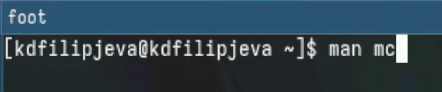{#fig:1 width=100%}

Информация про оболочку(рис. [-@fig:2]).

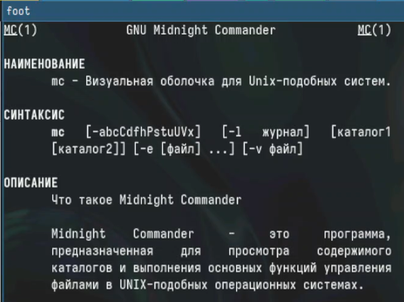{#fig:2 width=100%}

Сама оболочка(рис. [-@fig:3]).

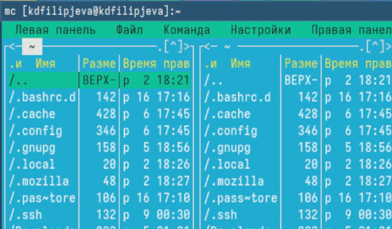{#fig:3 width=100%}

Как работает выделение файлов в оболочке(рис. [-@fig:4]).

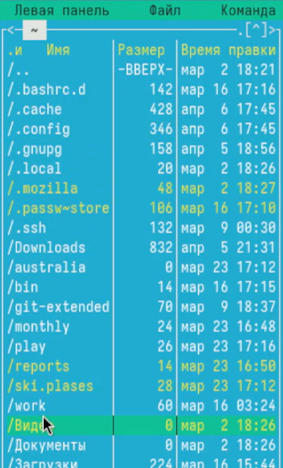{#fig:4 width=100%}

Как работает копирование файлов в оболочке(рис. [-@fig:5]).

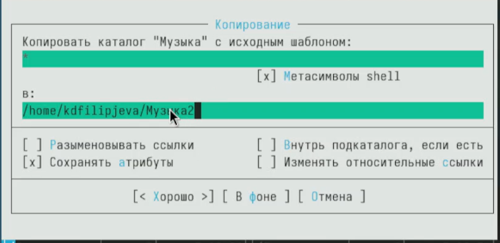{#fig:5 width=100%}

Как работает перемещение файлов в оболочке(рис. [-@fig:6]).

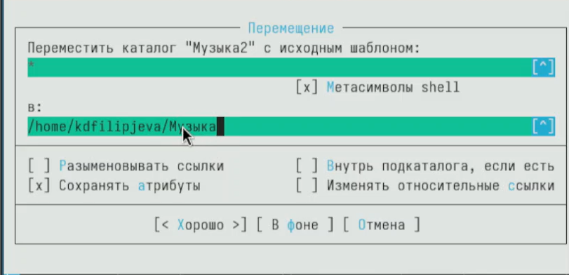{#fig:6 width=100%}

Как выглядит информация о документе в правой панели(рис. [-@fig:7]).

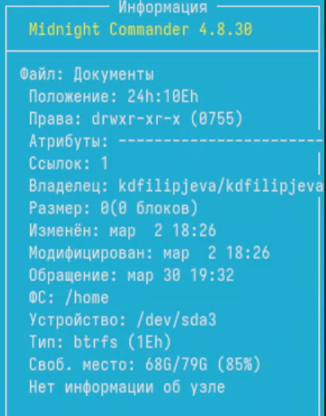{#fig:7 width=100%}

Все возможности правой панели(рис. [-@fig:8]).

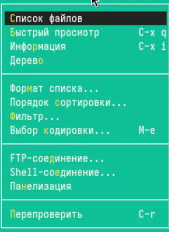{#fig:8 width=100%}

Возможность вывода списка файлов(рис. [-@fig:9]).

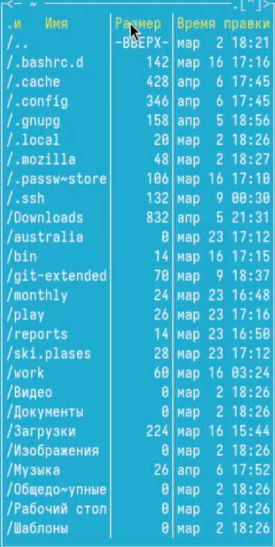{#fig:9 width=100%}

Возможность быстрого просмотра содержимого файла (рис. [-@fig:10]).

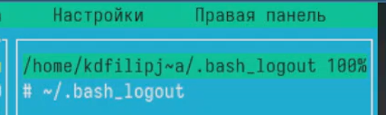{#fig:10 width=100%}

Вывод информации о файле(рис. [-@fig:11]).

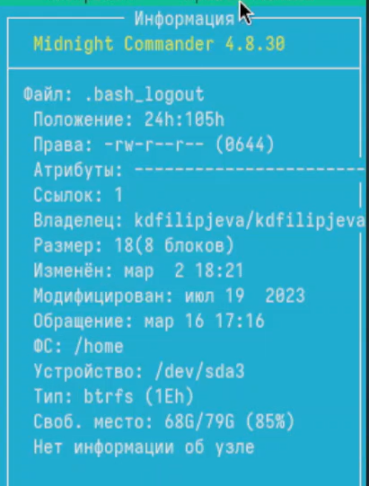{#fig:11 width=100%}

Вывод дерева каталогов данного каталога (рис. [-@fig:12]).

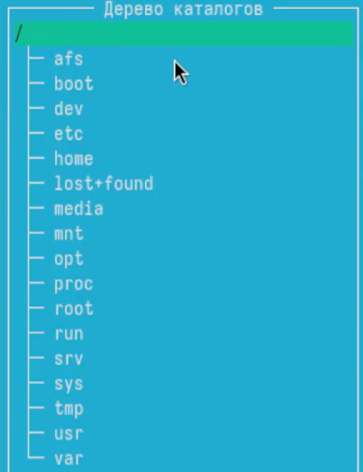{#fig:12 width=100%}

Возможности подменю файл(рис. [-@fig:13]).

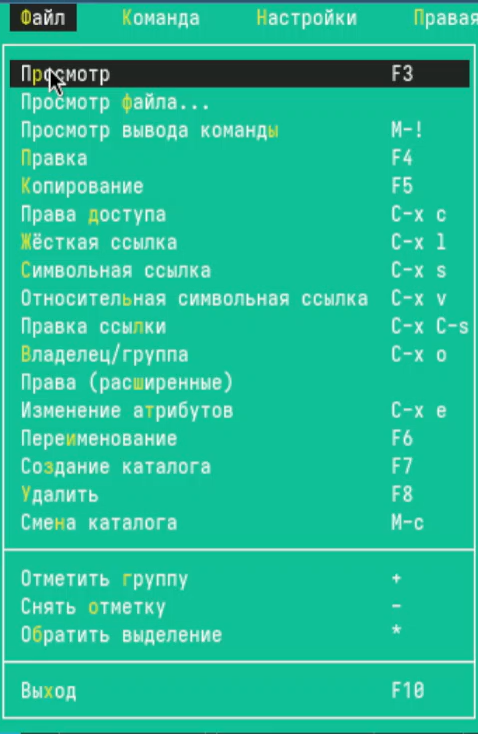{#fig:13 width=100%}

Просмотр текстового файла(рис. [-@fig:14]).

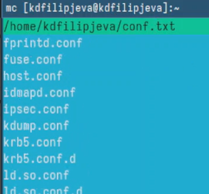{#fig:14 width=100%}

Создание нового каталога(рис. [-@fig:15]).

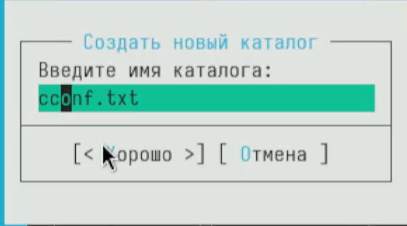{#fig:15 width=100%}

Копирование файла в только что созданный каталог(рис. [-@fig:16]).

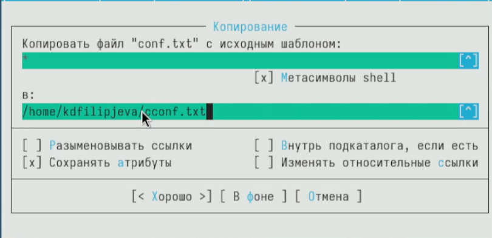{#fig:16 width=100%}

Возможности подменю Команда(рис. [-@fig:17]).

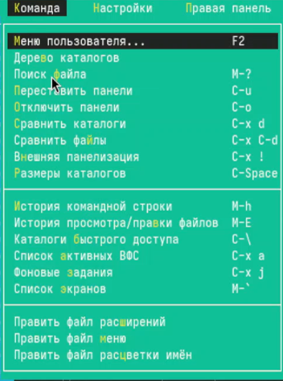{#fig:17 width=100%}

Поиск файлов по заданным критериям(рис. [-@fig:18]).

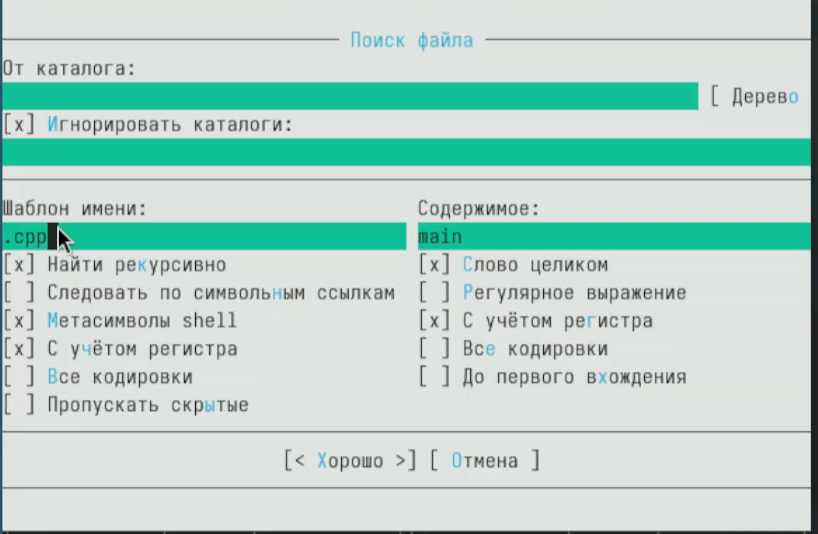{#fig:18 width=100%}

Выведение недавних команд(рис. [-@fig:19]).

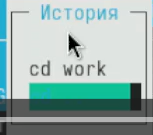{#fig:19 width=100%}

Возможность быстрого перехода к домашнему каталогу(рис. [-@fig:20]).

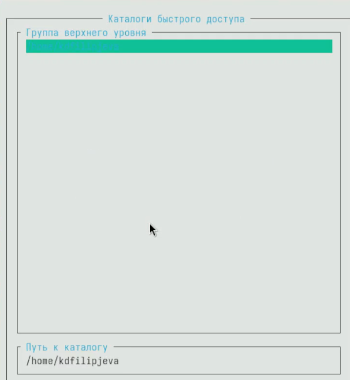{#fig:20 width=100%}

Проанализируем файл расширений(рис. [-@fig:21]).

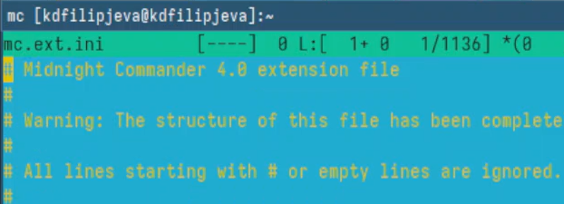{#fig:21 width=100%}

Проанализируем файл меню(рис. [-@fig:22]).

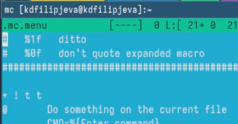{#fig:22 width=100%}

Возможности настройки персонализации(рис. [-@fig:23]).

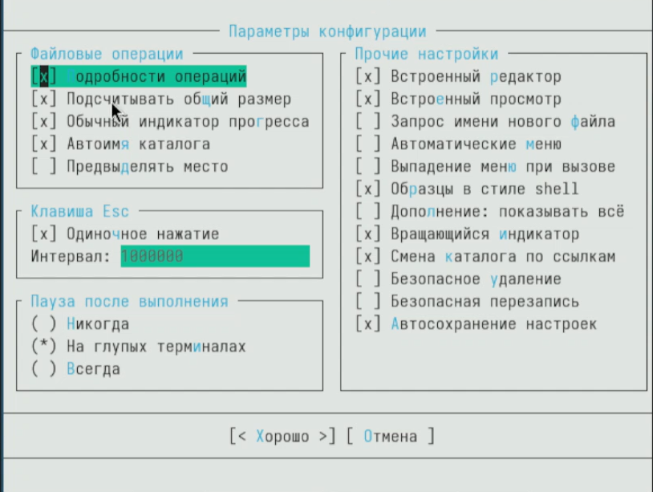{#fig:23 width=100%}

Возможности настройки персонализации(рис. [-@fig:24]).

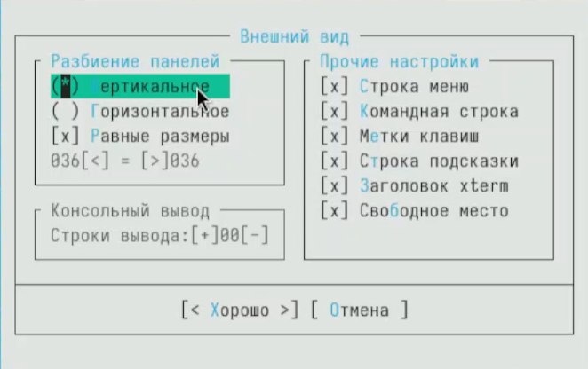{#fig:24 width=100%}

Возможности настройки персонализации(рис. [-@fig:25]).

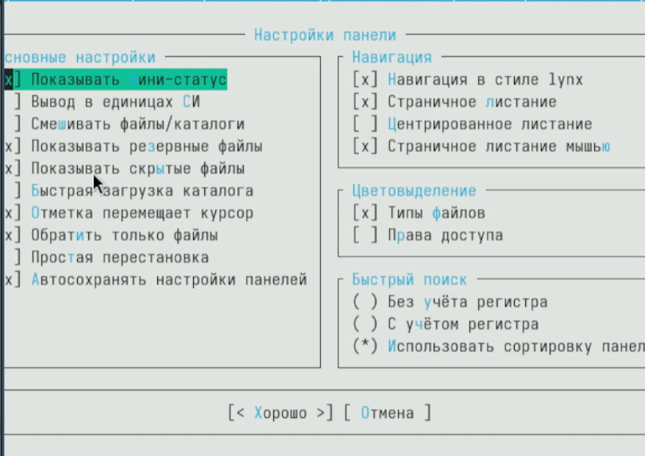{#fig:25 width=100%}

Создание файла через консоль(рис. [-@fig:26]).

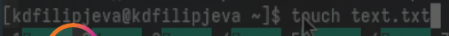{#fig:26 width=100%}

Просмотр созданного только что файла(рис. [-@fig:27]).

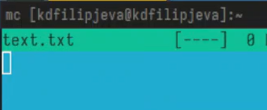{#fig:27 width=100%}

Случайный текст из интернета для дальнейших действий(рис. [-@fig:28]).

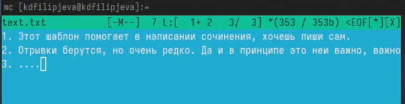{#fig:28 width=100%}

Удаление строки комбинацией клавиш(рис. [-@fig:29]).

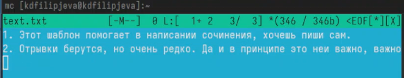{#fig:29 width=100%}

Копирование строки комбинацией клавиш(рис. [-@fig:30]).

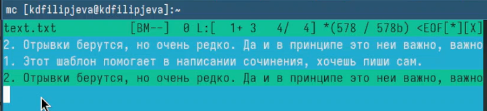{#fig:30 width=100%}

Перемещение строки комбинацией клавиш(рис. [-@fig:31]).

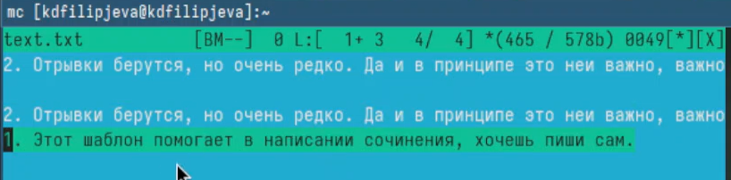{#fig:31 width=100%}

Сохранение файла комбинацией клавиш(рис. [-@fig:32]).

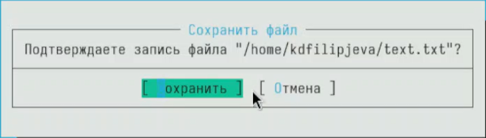{#fig:32 width=100%}

Текст в начале и в конце, вставленный с помощью комбинации клавиш(рис. [-@fig:33]).

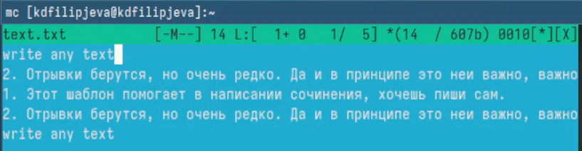{#fig:33 width=100%}

Отключение синтаксиса в файле с языком программирования(рис. [-@fig:34]).

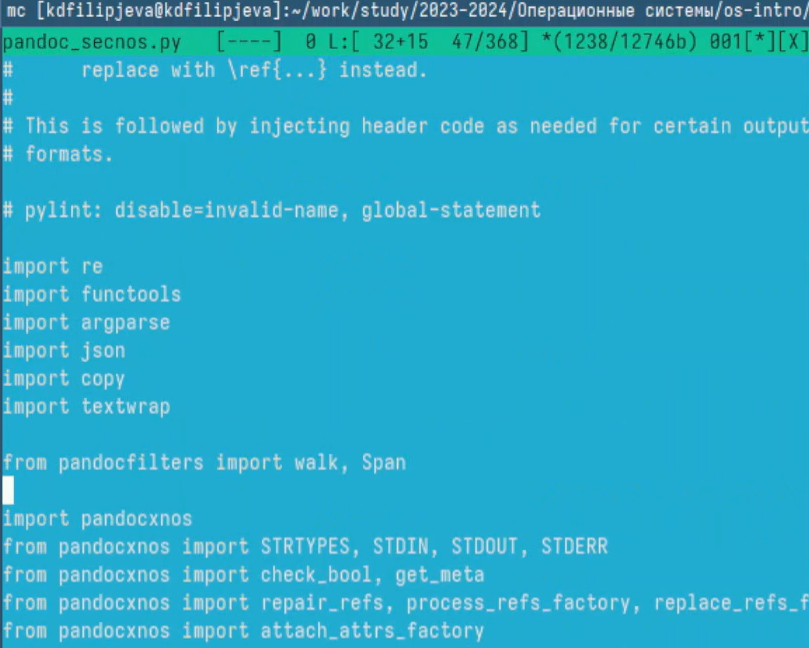{#fig:34 width=100%}

# Выводы

Мы получили новые и отработали уже имеющиеся навыки работы с оболочкой Midnight Commander.

# Ответы на вопросы

1. Основные режимы работы в mc:
- Двухпанельный режим - две панели, каждая показывает содержимое директории. Используется для навигации по файловой системе и выполнения операций с файлами.
- Однопанельный режим - только одна панель. Можно переключаться между панелями Tab-ом.
- Режим быстрого просмотра (по F3) - просмотр содержимого текущего файла без открытия в редакторе.
- Режим дерева каталогов (по F9) - древовидное представление файловой системы.

2. Операции с файлами, доступные и через команды shell, и через меню mc:
- Копирование (F5, cp)
- Перемещение (F6, mv) 
- Удаление (F8, rm)
- Переименование (F6 дважды, mv)
- Изменение прав доступа (Ctrl+x c, chmod)
- Создание символических ссылок (Ctrl+x s, ln -s)

3. Меню левой/правой панели:
- Просмотр (F3) - быстрый просмотр файла
- Правка (F4) - открыть файл во встроенном редакторе
- Копировать (F5), Переименовать/Переместить (F6) 
- Создать каталог (F7), Удалить (F8)
- Дерево (F9) - переключение в режим дерева каталогов
- Выход (F10)

4. Меню Файл:
- Просмотр, Правка, Копировать, Переименовать/Переместить, Создать каталог, Удалить - аналогично меню панели
- Упаковать, Распаковать - работа с архивами
- Сравнить по содержимому - сравнение двух файлов
- Изменить права доступа, Изменить владельца/группу - управление правами на файл

5. Меню Команда:
- Перейти на другую панель - переключение активной панели
- Отметить, Снять отметку, Инвертировать отметку - групповые операции с файлами
- Найти файл, Повторить поиск, Внешняя панелизация - поиск файлов и отображение результатов на панели
- Сменить режим, Сменить формат листинга - настройка отображения панелей
- Завершить работу - выход из mc

6. Меню Настройки:
- Параметры - основные настройки mc
- Подсветка синтаксиса - настройка подсветки для редактора
- Подтверждения - настройка подтверждений для потенциально опасных действий
- Внешний вид - настройка цветов, макета панелей и т.д.
- Сохранить настройку - сохранение текущих настроек

7. Встроенные команды mc:
- Быстрый поиск (Alt+?) - инкрементный поиск файла на панели
- Калькулятор (Ctrl+k) - простой калькулятор
- Дерево каталогов (F9) - древовидное представление файловой системы
- Просмотр (F3), Правка (F4) - работа с файлами
- Копирование (F5), Перемещение (F6), Удаление (F8) - файловые операции
- Создание каталога (F7) 
- Смена активной панели (Alt+i,o)

8. Команды встроенного редактора mc:
- Сохранить (F2), Выход (F10) 
- Поиск (F7), Продолжить поиск (Ctrl+s)
- Замена (F4)
- Перейти к строке (Alt+g)
- Выделить блок (Shift+F3), Копировать блок (Ctrl+f), Удалить блок (Ctrl+y), Вставить блок (Ctrl+u)
- Отменить (Ctrl+u), Вернуть (Alt+r)
- Форматирование абзаца (Alt+p)
- Проверка орфографии (Alt+s)

9. Создание пользовательских меню в mc:
- Файл ~/.config/mc/menu содержит определения меню
- Формат: ИмяМеню, ПунктМеню, Команда
- Разделение пунктов меню - пустые строки
- Специальные символы: %i - имя файла, %d - имя каталога
- Пример: 
MyMenu
Compress tar.gz, tar cvzf %i.tar.gz %i
Compress zip, zip -r %i.zip %i

10. Действия над текущим файлом, определяемые пользователем:
- Файл ~/.config/mc/mc.ext содержит определения действий
- Формат: Маска ИмяДействия Команда
- Маска - шаблон имени файла (поддерживает *, ?)
- ИмяДействия - текст пункта меню
- Команда - команда shell для выполнения
- Пример:
*.txt Open in vim
vim %i
