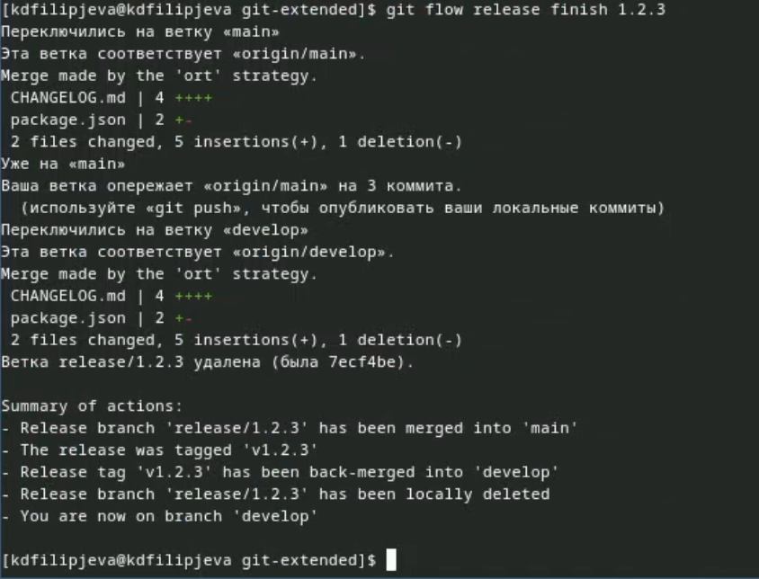

---
## Front matter
title: "Отчёт по лабораторной работе №4"
subtitle: "Дисциплина: Архитектура компьютеров"
author: "Филипьева Ксения Дмитриевна"

## Generic otions
lang: ru-RU
toc-title: "Содержание"

## Bibliography
bibliography: bib/cite.bib
csl: pandoc/csl/gost-r-7-0-5-2008-numeric.csl

## Pdf output format
toc: true # Table of contents
toc-depth: 2
lof: true # List of figures
fontsize: 12pt
linestretch: 1.5
papersize: a4
documentclass: scrreprt
## I18n polyglossia
polyglossia-lang:
  name: russian
  options:
    - spelling=modern
    - babelshorthands=true
polyglossia-otherlangs:
  name: english
## I18n babel
babel-lang: russian
babel-otherlangs: english
## Fonts
sansfont: PT Sans
monofont: PT Mono
mainfontoptions: Ligatures=TeX
romanfontoptions: Ligatures=TeX
sansfontoptions: Ligatures=TeX,Scale=MatchLowercase
monofontoptions: Scale=MatchLowercase,Scale=0.9
## Biblatex
biblatex: true
biblio-style: "gost-numeric"
biblatexoptions:
  - parentracker=true
  - backend=biber
  - hyperref=auto
  - language=auto
  - autolang=other*
  - citestyle=gost-numeric
## Pandoc-crossref LaTeX customization
figureTitle: "Рис."
tableTitle: "Таблица"
listingTitle: "Листинг"
lofTitle: "Список иллюстраций"
lolTitle: "Листинги"
## Misc options
indent: true
header-includes:
  - \usepackage{indentfirst}
  - \usepackage{float} # keep figures where there are in the text
  - \floatplacement{figure}{H} # keep figures where there are in the text
---

# Цель работы

Получение навыков правильной работы с репозиториями git.

# Задание

1. Выполнить работу для тестового репозитория.
2. Преобразовать рабочий репозиторий в репозиторий с git-flow и conventional commits.

# Теоретическое введение

Gitflow Workflow опубликована и популяризована Винсентом Дриссеном.
Gitflow Workflow предполагает выстраивание строгой модели ветвления с учётом выпуска проекта.
Данная модель отлично подходит для организации рабочего процесса на основе релизов.
Работа по модели Gitflow включает создание отдельной ветки для исправлений ошибок в рабочей среде.

# Выполнение лабораторной работы

 Открываем ТУИС и приступаем к выполнению четвертой лабораторной работы (рис. @fig:1)

{#fig:1 width=100%}

  Вводим команды для установки git-flow. (рис. @fig:2)
  
{#fig:2 width=90%}
  
  Вводим команды для установки Node.js (рис. @fig:3)
  
{#fig:3 width=100%}
 
  Поскольку команда для установки pnpm устарела, установим напрямую, взяв команду с сайта (рис. @fig:4)
  
{#fig:4 width=100%}
 
  После окончания установки вводим команды для авторизации в pnpm (рис. @fig:5)
  
{#fig:5 width=100%}

  Далее устанавливаем команды, которые помогут в форматировании комитов и создании логов. (рис. @fig:6)
  
{#fig:6 width=100%}

  Создаем новый репозиторий git-extended (рис. @fig:7)

{#fig:7 width=100%}

  Клонируем наш созданный репозиторий в локальное хранилище(рис. @fig:8)

{#fig:8 width=100%}

  Создадим файл, чтобы репозиторий не был пустым(рис. @fig:9)

{#fig:9 width=100%}

  Введем что-то в наш созданный файл(рис. @fig:10)

{#fig:10 width=100%}

  Проиндексируем файлы, находящиеся в папке, а также сделаем коммит (рис. @fig:11)
  
{#fig:11 width=100%}

  Подключим наш репозиторий к ОС и отправим файлы в ветку main(рис. @fig:12)

{#fig:12 width=100%}

  Выведем конфигурацию общепринятых коммитов, которая имеется сейчас(рис. @fig:13)
  
{#fig:13 width=100%}

  Отредактируем конфигурацию общепринятых коммитов под нас(рис. @fig:14)

{#fig:14 width=100%}

  Проиндексируем новые файлы и сделаем коммит(рис. @fig:15)

{#fig:15 width=100%}

  Отправим файлы на гитхаб(рис. @fig:16)
  
{#fig:16 width=100%}

  Инициализируем и настроим git flow(рис. @fig:17)

{#fig:17 width=100%}

  Проверим ветку, в которой мы находимся и отправим файлы в хранилище(рис. @fig:18)
  
{#fig:18 width=100%}

  Установим ветку как вышестоящую для нынешней и создадим релиз с версией 1.0.0(рис. @fig:19)
  
{#fig:19 width=100%}

  Создадим журнал изменений и проиндексируем его(рис. @fig:20)
  
{#fig:20 width=100%}

  Зальем нашу релизную ветку в основную(рис. @fig:21)
  
{#fig:21 width=100%}

  Отправим данные на гитхаб(рис. @fig:22)
  
{#fig:22 width=100%}

  Создадим релиз на гитхабе(рис. @fig:23)
  
{#fig:23 width=100%}

  Создадим ветку для новой функциональности и сразу объеденим ее с веткой develop, потому что никаких изменений мы не вносили(рис. @fig:24)
  
{#fig:24 width=100%}

  Создадим релиз с версией 1.2.3 и отредактируем файл package.json для этой версии(рис. @fig:25)
  
{#fig:25 width=100%}

  Создадим журнал изменений, проиндексируем его и сделаем коммит(рис. @fig:26)
  
{#fig:26 width=100%}

  Зальем релизную ветку в основную(рис. @fig:27)
  
{#fig:27 width=100%}

  Отправим все данные на гитхаб и создадим релиз с комментариями из журнала изменений(рис. @fig:28)
  
{#fig:28 width=100%}
 
# Выводы

В ходе лабораторной работы мы научились продвинутому использованию гитхаба.
