---
## Front matter
title: "Отчет о выполнении лабораторной работы"
subtitle: "Лабораторная работа №5"
author: "Филипьева Ксения Дмитриевна"

## Generic otions
lang: ru-RU
toc-title: "Содержание"

## Bibliography
bibliography: bib/cite.bib
csl: pandoc/csl/gost-r-7-0-5-2008-numeric.csl

## Pdf output format
toc: true # Table of contents
toc-depth: 2
lof: true # List of figures
lot: true # List of tables
fontsize: 12pt
linestretch: 1.3
papersize: a4
documentclass: scrreprt
## I18n polyglossia
polyglossia-lang:
  name: russian
  options:
	- spelling=modern
	- babelshorthands=true
polyglossia-otherlangs:
  name: english
## I18n babel
babel-lang: russian
babel-otherlangs: english
## Fonts
mainfont: PT Serif
romanfont: PT Serif
sansfont: PT Sans
monofont: PT Mono
mainfontoptions: Ligatures=TeX
romanfontoptions: Ligatures=TeX
sansfontoptions: Ligatures=TeX,Scale=MatchLowercase
monofontoptions: Scale=MatchLowercase,Scale=0.9
## Biblatex
biblatex: true
biblio-style: "gost-numeric"
biblatexoptions:
  - parentracker=true
  - backend=biber
  - hyperref=auto
  - language=auto
  - autolang=other*
  - citestyle=gost-numeric
## Pandoc-crossref LaTeX customization
figureTitle: "Рис."
tableTitle: "Таблица"
listingTitle: "Листинг"
lofTitle: "Список иллюстраций"
lotTitle: "Список таблиц"
lolTitle: "Листинги"
## Misc options
indent: true
header-includes:
  - \usepackage{indentfirst}
  - \usepackage{float} # keep figures where there are in the text
  - \floatplacement{figure}{H} # keep figures where there are in the text
---

# Цель работы

Настройка рабочей среды ОС Fedora.

# Задание

1. Настроить интерфейс для работы с браузером

# Теоретическое введение

## Менеджер паролей pass

    - Менеджер паролей pass — программа, сделанная в рамках идеологии Unix.
    - Также носит название стандартного менеджера паролей для Unix (The standard Unix password manager).

## Основные свойства

    - Данные хранятся в файловой системе в виде каталогов и файлов.
    - Файлы шифруются с помощью GPG-ключа.

# Выполнение лабораторной работы

Установка менеджера паролей pass (рис. @fig:1).

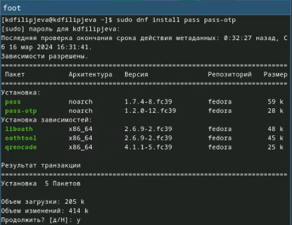{#fig:1 width=100%}

Установка вспомогательного функционала gopass(рис. @fig:2).

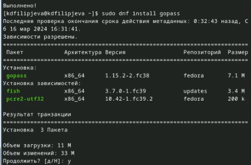{#fig:2 width=100%}

Выведем список наших gpg-ключей (рис. @fig:3).

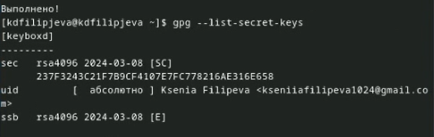{#fig:3 width=100%}

Инициализируем хранилище с помощью pass (рис. @fig:4).

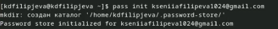{#fig:4 width=100%}

Создадим репозиторий для работы с паролями (рис. @fig:5).

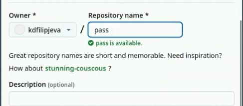{#fig:5 width=100%}

Введем команду pass git init для того, чтобы создать структуру git, а также подключим этот репозиторий к нашей ВМ (рис. @fig:6).

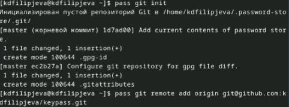{#fig:6 width=100%}

Введя команду pass git push нам предложат ввести ее с опциями, для назначения главной ветки репозитория. Введем (рис. @fig:7).

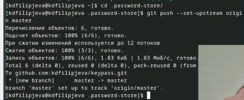{#fig:7 width=100%}

Нас просят выгрузить всё из этого каталога на гитхаб, но поскольку никаких изменений мы в него не вносили, то и выгружать нечего.(рис. @fig:8).

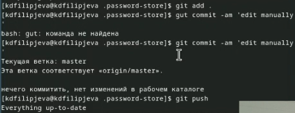{#fig:8 width=100%}

Введем pass git status чтобы узнать синхронизации локального каталога с гитхабом.(рис. @fig:9).

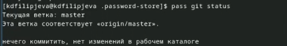{#fig:9 width=100%}

Установим программу native messaging для более комфортного использования браузера, а также браузерное расширение для этой программы(рис. @fig:10)(рис. @fig:11).

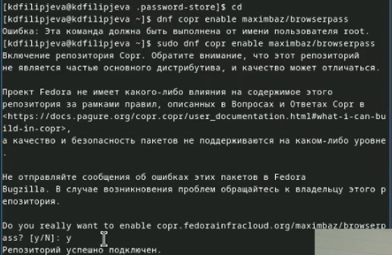{#fig:10 width=100%}

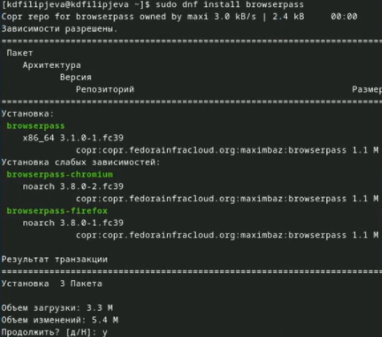{#fig:11 width=100%}

Создадим файл testpass.txt чтобы проверить на нем работоспособность утилиты pass. Установим для этого файла пароль, отобразим его, а после поменяем на надежный, сгенерированный для нас утилитой пароль (рис. @fig:12).

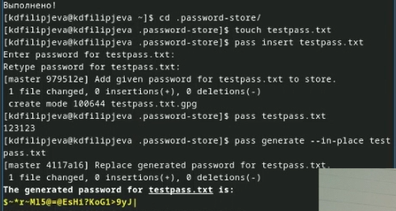{#fig:12 width=100%}

Установим недостоющее дополнительное програмное обеспечение (рис. @fig:13).

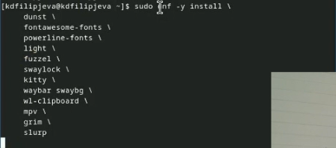{#fig:13 width=100%}

Установим недостающие шрифты(рис. @fig:14)(рис. @fig:15)(рис. @fig:16).

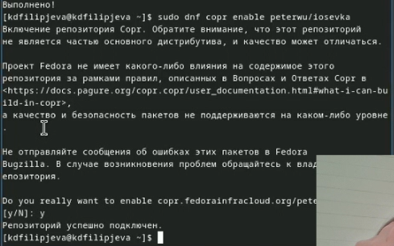{#fig:14 width=100%}

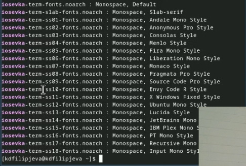{#fig:15 width=100%}

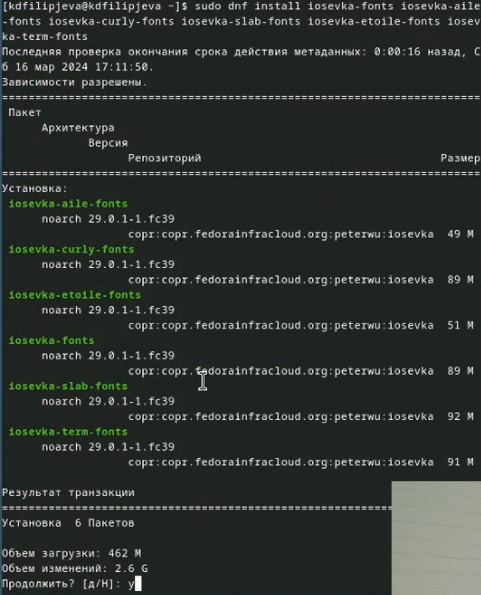{#fig:16 width=100%}

Установим без подверждений утилиту chezmoi (рис. @fig:17).

{#fig:17 width=100%}

Создадим репозиторий, предназначенный для только что установленной утилиты (рис. @fig:18).

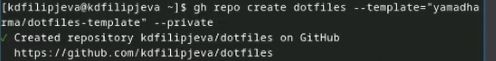{#fig:18 width=100%}

Инициализируем созданный репозиторий (рис. @fig:19).

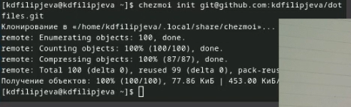{#fig:19 width=100%}

Применим все изменения, которые нам предложил chezmoi (рис. @fig:20).

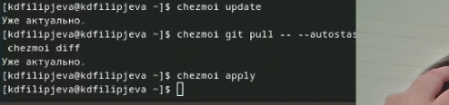{#fig:20 width=100%}

Включим функцию автоматической фиксации и отправки изменений в исходный каталог в репозиторие (рис. @fig:21).

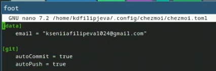{#fig:21 width=100%}

# Выводы

Мы настроили интерфейс операционной системы для более комфортной работы с браузером.

