---
## Front matter
title: "Отчет о выполнении лабораторной работы"
subtitle: "Лабораторная работа №7"
author: "Филипьева Ксения Дмитриевна"

## Generic otions
lang: ru-RU
toc-title: "Содержание"

## Bibliography
bibliography: bib/cite.bib
csl: pandoc/csl/gost-r-7-0-5-2008-numeric.csl

## Pdf output format
toc: true # Table of contents
toc-depth: 2
lof: true # List of figures
lot: true # List of tables
fontsize: 12pt
linestretch: 1.3
papersize: a4
documentclass: scrreprt
## I18n polyglossia
polyglossia-lang:
  name: russian
  options:
	- spelling=modern
	- babelshorthands=true
polyglossia-otherlangs:
  name: english
## I18n babel
babel-lang: russian
babel-otherlangs: english
## Fonts
mainfont: PT Serif
romanfont: PT Serif
sansfont: PT Sans
monofont: PT Mono
mainfontoptions: Ligatures=TeX
romanfontoptions: Ligatures=TeX
sansfontoptions: Ligatures=TeX,Scale=MatchLowercase
monofontoptions: Scale=MatchLowercase,Scale=0.9
## Biblatex
biblatex: true
biblio-style: "gost-numeric"
biblatexoptions:
  - parentracker=true
  - backend=biber
  - hyperref=auto
  - language=auto
  - autolang=other*
  - citestyle=gost-numeric
## Pandoc-crossref LaTeX customization
figureTitle: "Рис."
tableTitle: "Таблица"
listingTitle: "Листинг"
lofTitle: "Список иллюстраций"
lotTitle: "Список таблиц"
lolTitle: "Листинги"
## Misc options
indent: true
header-includes:
  - \usepackage{indentfirst}
  - \usepackage{float} # keep figures where there are in the text
  - \floatplacement{figure}{H} # keep figures where there are in the text
---

# Цель работы

Ознакомление с файловой системой Linux, её структурой, именами и содержанием каталогов. Приобретение практических навыков по применению команд для работы с файлами и каталогами, по управлению процессами (и работами), по проверке использования диска и обслуживанию файловой системы.

# Задание

Попрактиковать использование частых команд для работы с файлами и каталогами.

# Теоретическое введение

Для работы с файлами можно использовать множество команд, например: cat, touch, less и другие.
Для работы с каталогами можно использовать множество команд, например: cd, cp, mv и прочие.

# Выполнение лабораторной работы

Перейдем в домашний каталог, создадим файл abc1, а после скопируем его с именами april и may. Проверим правильность выполнения(рис. [-@fig:1]).

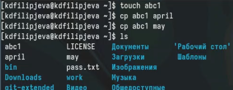{#fig:1 width=100%}

Создадим каталог monthly и переместим в него файлы april, may. Проверим переметились ли они(рис. [-@fig:2]).

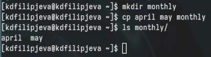{#fig:2 width=100%}

С помощью команды ср переименуем файл may в файл june (рис. [-@fig:3]).

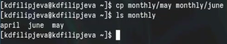{#fig:3 width=100%}

Создадим каталог monthly.00, а после рекурсивно скопируем в него каталог monthly (рис. [-@fig:4]).

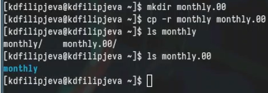{#fig:4 width=100%}

Рекурсивно скопируем созданный только что каталог в каталог /tmp (рис. [-@fig:5]).

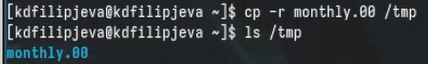{#fig:5 width=100%}

Перейдем в домашний каталог и переименуем файл april в файл july. Проверим на правильность(рис. [-@fig:6]).

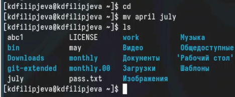{#fig:6 width=100%}

Переместим файл july в каталог monthly.00 (рис. [-@fig:7]).

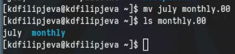{#fig:7 width=100%}

Переименуем каталог monthly.00 в каталог monthly.01 (рис. [-@fig:8]).

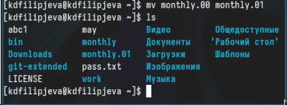{#fig:8 width=100%}

Создадим каталог reports и переместим каталог monthly.01 в него (рис. [-@fig:9]).

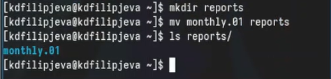{#fig:9 width=100%}

Переименуем каталог monthly.01 внутри каталога reports в monthly (рис. [-@fig:10]).

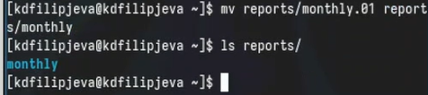{#fig:10 width=100%}

Создадим файл may и выдадим ему права на выполнение, проверим выдались ли они. (рис. [-@fig:11]).

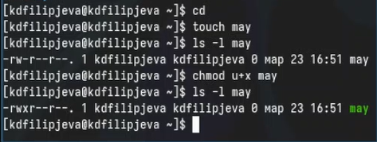{#fig:11 width=100%}

После, сразу заберем у этого файла права на выполнение (рис. [-@fig:12]).

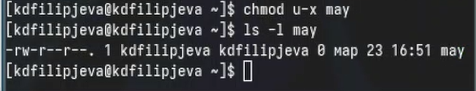{#fig:12 width=100%}

Удалим ранее созданный каталог monthly, а после создадим заново, чтобы не было наложения прав между ними. Заберем права для группы и остальных на чтение файла. (рис. [-@fig:13]).

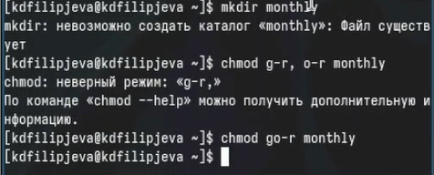{#fig:13 width=100%}

Проверим правильность отобранных прав (рис. [-@fig:14]).

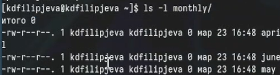{#fig:14 width=100%}

Опять создадим файл abc1 и выдадим права для группы на изменение этого файла, а после проверим правильность (рис. [-@fig:15]).

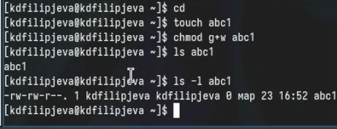{#fig:15 width=100%}

Скопируем файл io.h в домашний каталог и назовем его equipment (рис. [-@fig:16]).

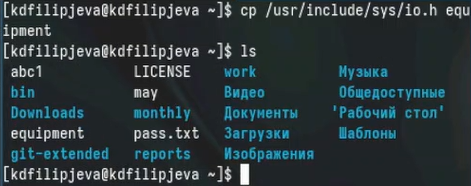{#fig:16 width=100%}

Создадим каталог, а после переместим в него только что скопированный файл (рис. [-@fig:17]).

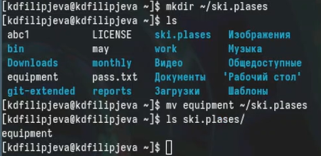{#fig:17 width=100%}

Переименуем перемещенный файл в equiplist (рис. [-@fig:18]).

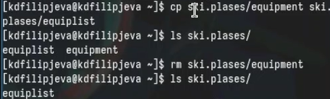{#fig:18 width=100%}

В очередной раз создадим файл abc1 и переместим его в наш каталог под именем equiplist2 (рис. [-@fig:19]).

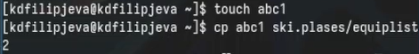{#fig:19 width=100%}

Создадим внутри нашего каталога еще один каталог под именем equipment (рис. [-@fig:20]).

{#fig:20 width=100%}

Переместим все файлы с этого каталога в новый, только что созданный (рис. [-@fig:21]).

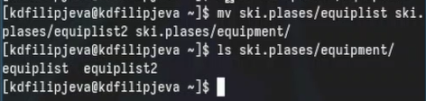{#fig:21 width=100%}

Создадим новый каталог newdir и переместим его в каталог ski.places под именем plans (рис. [-@fig:22]).

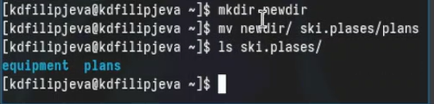{#fig:22 width=100%}

Создадим каталоги и файлы для выдачи им прав (рис. [-@fig:23]).

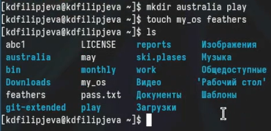{#fig:23 width=100%}

Выдадим права файлам и каталогам, которые только что создали (рис. [-@fig:24]).

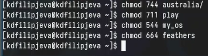{#fig:24 width=100%}

Проверим правильно ли были выданы права (рис. [-@fig:25]).

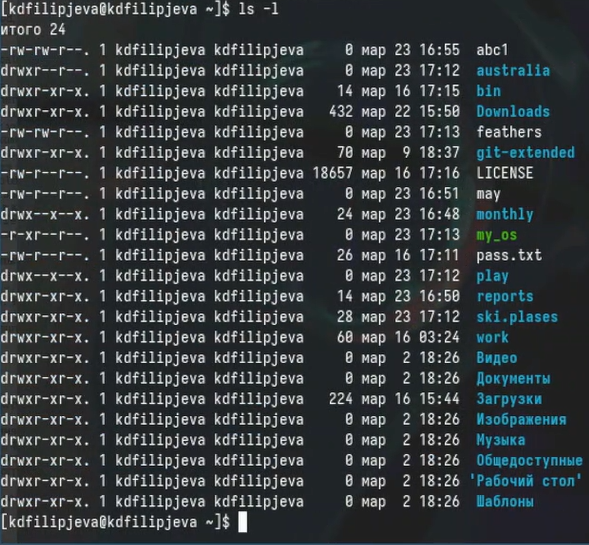{#fig:25 width=100%}

Попробуем промотреть содержимое файла password в каталоге etc, но увидим, что такого файла не существует (рис. [-@fig:26]). 

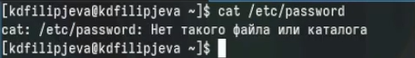{#fig:26 width=100%}

Переместим файл feathers в каталог file.old (рис. [-@fig:27]).

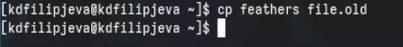{#fig:27 width=100%}

Переместим каталог file.old в каталог play (рис. [-@fig:28]).

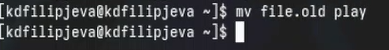{#fig:28 width=100%}

Рекурсивно скопируем каталог play в каталог fun (рис. [-@fig:29]).

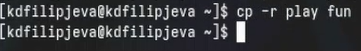{#fig:29 width=100%}

А после переместим каталог fun в каталог play под именем games (рис. [-@fig:30]).

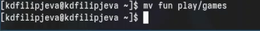{#fig:30 width=100%}

Заберем права на чтение файла feathers у владельца и попробуем открыть через команду cat, после чего получим отказ (рис. [-@fig:31]).

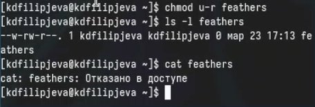{#fig:31 width=100%}

Попробуем переместить этот файл в любую папку, на что тоже получим отказ. После вернем права для владельца на чтение этого файла. (рис. [-@fig:32]).

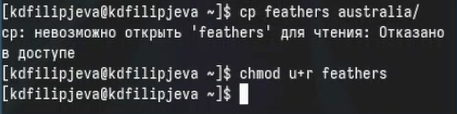{#fig:32 width=100%}

Заберем права на выполнение у папки play и после попробуем перейти в нее, на что получим отказ. Вернем права на выполнение папке (рис. [-@fig:33]).

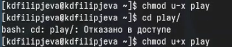{#fig:33 width=100%}

Описание команды mount, которая позволяет нам монтировать директрорию в нашу систему (рис. [-@fig:34]).

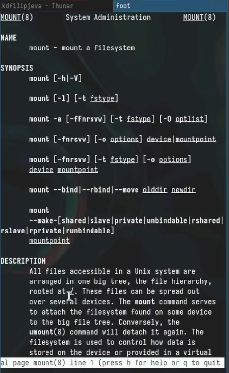{#fig:34 width=100%}

Описание команды fsck, которая позволяет в случае поломки восстановить нашу файловую систему. (рис. [-@fig:35]).

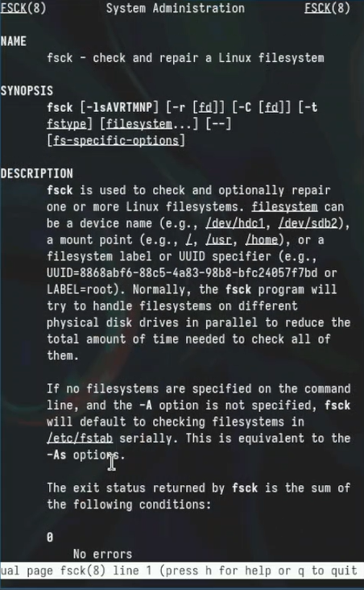{#fig:35 width=100%}

Описание команды mkfs, которая позволяет с нуля строить файловую систему в нашей ОС Линукс (рис. [-@fig:36]).

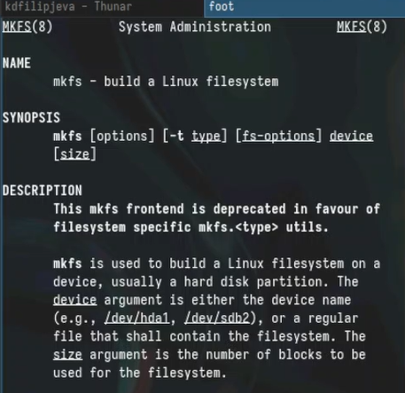{#fig:36 width=100%}

Описание команды kill, которая позволяет нам завершить любой процесс. (рис. [-@fig:37]).

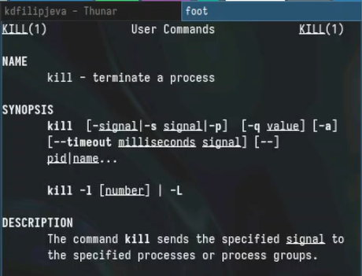{#fig:37 width=100%}

# Выводы

Мы освоили частые команды для работы с файлами и каталогами на практике, а также узнали о их опциях более подробно.

# Ответы на контрольные вопросы

2. Общая структура файловой системы:
   - / (корневой каталог) - верхний уровень файловой системы, содержащий основные директории:
     - /bin - основные исполняемые файлы системы
     - /etc - конфигурационные файлы системы
     - /home - домашние каталоги пользователей
     - /usr - дополнительные программы и библиотеки
     - /var - переменные данные, журналы и кэши

3. Операция монтирования файловой системы:
   Для того, чтобы содержимое файловой системы стало доступно операционной системе, необходимо выполнить операцию монтирования. Это связывает файловую систему с определенной точкой доступа (точкой монтирования) в файловой иерархии.

4. Причины нарушения целостности файловой системы:
   - Аппаратные сбои (неполадки жесткого диска)
   - Программные ошибки (некорректное завершение работы ОС, сбои приложений)
   - Вирусные атаки
   Для восстановления повреждений можно использовать средства проверки и восстановления файловой системы, такие как fsck (для ext4) или chkdsk (для NTFS).

5. Создание файловой системы:
   Файловая система создается при форматировании раздела жесткого диска. Этот процесс инициализирует структуры данных, необходимые для организации файлов и каталогов на диске.

6. Команды для просмотра текстовых файлов:
   - cat - выводит содержимое файла
   - less - постраничный просмотр файла
   - head - выводит первые несколько строк файла
   - tail - выводит последние несколько строк файла

7. Возможности команды cp в Linux:
   - Копирование файлов и каталогов
   - Рекурсивное копирование каталогов
   - Сохранение атрибутов файлов
   - Переименование файлов при копировании

8. Возможности команды mv в Linux:
   - Перемещение файлов и каталогов
   - Переименование файлов
   - Перемещение файлов между каталогами

9. Права доступа:
   Права доступа определяют, кто (пользователь, группа или все) может выполнять определенные операции (чтение, запись, выполнение) с файлом или каталогом.
   Изменить права доступа можно с помощью команды chmod.
