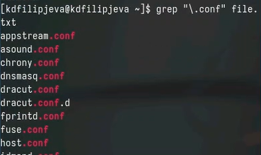
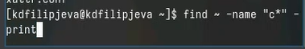
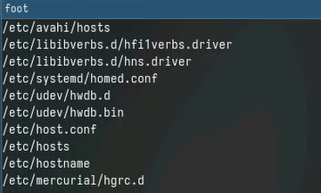
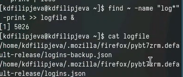
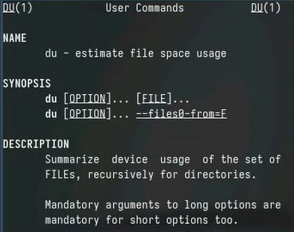

---
## Front matter
title: "Отчет о выполнении лабораторной работы"
subtitle: "Лабораторная работа №8"
author: "Филипьева Ксения Дмитриевна"

## Generic otions
lang: ru-RU
toc-title: "Содержание"

## Bibliography
bibliography: bib/cite.bib
csl: pandoc/csl/gost-r-7-0-5-2008-numeric.csl

## Pdf output format
toc: true # Table of contents
toc-depth: 2
lof: true # List of figures
lot: true # List of tables
fontsize: 12pt
linestretch: 1.3
papersize: a4
documentclass: scrreprt
## I18n polyglossia
polyglossia-lang:
  name: russian
  options:
	- spelling=modern
	- babelshorthands=true
polyglossia-otherlangs:
  name: english
## I18n babel
babel-lang: russian
babel-otherlangs: english
## Fonts
mainfont: PT Serif
romanfont: PT Serif
sansfont: PT Sans
monofont: PT Mono
mainfontoptions: Ligatures=TeX
romanfontoptions: Ligatures=TeX
sansfontoptions: Ligatures=TeX,Scale=MatchLowercase
monofontoptions: Scale=MatchLowercase,Scale=0.9
## Biblatex
biblatex: true
biblio-style: "gost-numeric"
biblatexoptions:
  - parentracker=true
  - backend=biber
  - hyperref=auto
  - language=auto
  - autolang=other*
  - citestyle=gost-numeric
## Pandoc-crossref LaTeX customization
figureTitle: "Рис."
tableTitle: "Таблица"
listingTitle: "Листинг"
lofTitle: "Список иллюстраций"
lotTitle: "Список таблиц"
lolTitle: "Листинги"
## Misc options
indent: true
header-includes:
  - \usepackage{indentfirst}
  - \usepackage{float} # keep figures where there are in the text
  - \floatplacement{figure}{H} # keep figures where there are in the text
---

# Цель работы

Ознакомление с инструментами поиска файлов и фильтрации текстовых данных.
Приобретение практических навыков: по управлению процессами (и заданиями), по проверке использования диска и обслуживанию файловых систем.

# Задание

Приобрести и отработать уже имеющиеся навыки по управлению процессами и заданиями, а также проверке использования диска и обслуживанию файловых систем.

# Теоретическое введение

Инструменты поиска файлов, такие как команда find, позволяют эффективно находить нужные файлы в файловой системе по различным критериям - по имени, типу, размеру, времени создания и т.д.

Фильтрация текстовых данных осуществляется с помощью команд grep, sed, awk. Они позволяют находить в текстовых файлах нужную информацию по шаблонам, заменять и обрабатывать текст.

Для управления процессами используются команды ps, top, kill. С их помощью можно просматривать список запущенных процессов, отслеживать использование ресурсов, завершать зависшие процессы. Команды jobs, fg, bg предназначены для управления заданиями в текущей сессии терминала.

Для мониторинга использования дискового пространства и обслуживания файловых систем применяются команды df, du, fsck. Они позволяют проверить объем свободного места на разделах, размер каталогов, а также выполнить проверку и восстановление целостности файловой системы.

# Выполнение лабораторной работы

Запишем названия файлов, хранящихся в каталоге /etc в файл file.txt (рис. [-@fig:1]).

{#fig:1 width=100%}

Также запишем в этот файл названия файлов находящихся в нашем домашнем каталоге (рис. [-@fig:2]).

{#fig:2 width=100%}

Найдем все названия файлов в нашем файле, которые оканчиваются на .conf (рис. [-@fig:3]).

{#fig:3 width=100%}

Переместим найденные названия в новый файл conf.txt (рис. [-@fig:4]).

{#fig:4 width=100%}

Найдем и выведем в консоль все файлы из домашнего каталога, которые начинаются с английской с (рис. [-@fig:5]).

{#fig:5 width=100%}

Сделаем то же самое, только другим способом (рис. [-@fig:6]).

{#fig:6 width=100%}

Выведем в консоль все файлы из каталога /etc , которые начинаются на h(рис. [-@fig:7]).

{#fig:7 width=100%}

Найдем все файлы в домашнем каталоге которые начинаются на log и переместим их в файл logfile в фоновом режиме (рис. [-@fig:8]).

{#fig:8 width=100%}

Удалим получившийся файл logfile (рис. [-@fig:9]).

{#fig:9 width=100%}

Запустим gedit в фоновом режиме и узнаем его идентификатор (рис. [-@fig:10]).

{#fig:10 width=100%}

Поскольку при вводе команды ps у нас завершился фоновый процесс с gedit'ом, то команду kill использовать не имеет смысла (рис. [-@fig:11]).

{#fig:11 width=100%}

Описание команды kill (рис. [-@fig:12]).

{#fig:12 width=100%}

Описание команды df(рис. [-@fig:13]).

{#fig:13 width=100%}

Описание команды du (рис. [-@fig:14]).

{#fig:14 width=100%}

Результат выполнения команды df (рис. [-@fig:15]).

{#fig:15 width=100%}

Результат выполнения команды du (рис. [-@fig:16]).

{#fig:16 width=100%}

Используя команду find выведем все дирректории в нашем домашнем каталоге(рис. [-@fig:17]).

{#fig:17 width=100%}

# Выводы

Мы получили новые и отработали уже имеющиеся навыки работы с инструментами поиска файлов.

# Ответы на контрольные вопросы

1. Основные потоки ввода-вывода в Linux:
- stdin (стандартный ввод)
- stdout (стандартный вывод) 
- stderr (стандартный поток ошибок)

2. Операторы > и >>:
- > перенаправляет вывод команды в файл, перезаписывая его содержимое
- >> перенаправляет вывод команды в файл, добавляя его в конец файла

3. Конвейер (pipe) позволяет перенаправить вывод одной команды на ввод другой. Обозначается символом |. Например: cat file.txt | grep "hello"

4. Процесс - это экземпляр выполняющейся программы. Программа - это набор инструкций, а процесс - это работающая программа, имеющая выделенные ресурсы (память, файлы и т.д.)

5. PID (Process ID) - уникальный номер процесса. GID (Group ID) - идентификатор группы, к которой принадлежит процесс.

6. Задачи (jobs) - это процессы, запущенные в текущей сессии терминала. Ими можно управлять с помощью команд jobs, fg, bg.

7. top и htop - это утилиты для мониторинга запущенных процессов и использования ресурсов системы в реальном времени. htop имеет более удобный текстовый интерфейс.

8. Команда find используется для поиска файлов. Примеры:
- find /home -name "*.txt" - найти все файлы с расширением .txt в каталоге /home
- find . -type d - найти все подкаталоги в текущем каталоге

9. Да, для поиска по содержимому файлов можно использовать команду grep. Например:  
grep -r "hello world" /home - найти все вхождения фразы "hello world" в файлах каталога /home

10. Для определения свободного места на диске используется команда df -h 

11. Размер домашнего каталога можно узнать командой du -sh ~

12. Зависший процесс можно завершить командой kill. Например:
kill -9 1234 - принудительно завершить процесс с PID 1234.

