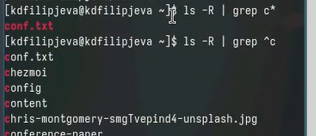
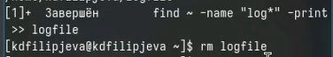
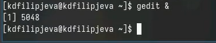
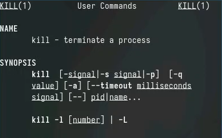
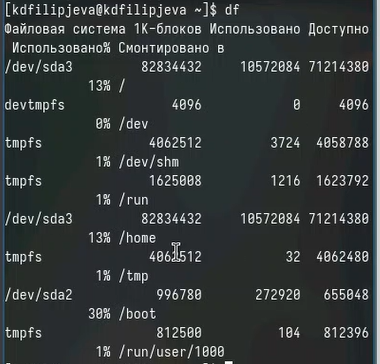
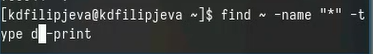

---
## Front matter
lang: ru-RU
title: Лабораторная работа №8
subtitle: Презентация
author:
  - Филипьева К.Д.
institute:
  - Российский университет дружбы народов, Москва, Россия
date: 30 марта 2024

## i18n babel
babel-lang: russian
babel-otherlangs: english

## Formatting pdf
toc: false
toc-title: Содержание
slide_level: 2
aspectratio: 169
section-titles: true
theme: metropolis
header-includes:
 - \metroset{progressbar=frametitle,sectionpage=progressbar,numbering=fraction}
 - '\makeatletter'
 - '\beamer@ignorenonframefalse'
 - '\makeatother'
 
## Fonts
mainfont: PT Serif
romanfont: PT Serif
sansfont: PT Sans
monofont: PT Mono
mainfontoptions: Ligatures=TeX
romanfontoptions: Ligatures=TeX
sansfontoptions: Ligatures=TeX,Scale=MatchLowercase
monofontoptions: Scale=MatchLowercase,Scale=0.9
---

# Информация

## Докладчик

:::::::::::::: {.columns align=center}
::: {.column width="70%"}

  * Филипьева Ксения Дмитриевна
  * Студент
  * Российский университет дружбы народов
  * [1132230795@pfur.ru](mailto:1132230795@pfur.ru)

:::
::: {.column width="30%"}

:::
::::::::::::::

## Цель

Ознакомление с инструментами поиска файлов и фильтрации текстовых данных.
Приобретение практических навыков: по управлению процессами (и заданиями), по проверке использования диска и обслуживанию файловых систем.

## Задачи

1. Осуществите вход в систему, используя соответствующее имя пользователя.
2. Запишите в файл file.txt названия файлов, содержащихся в каталоге /etc. Допишите в этот же файл названия файлов, содержащихся в вашем домашнем каталоге.
3. Выведите имена всех файлов из file.txt, имеющих расширение .conf, после чего запишите их в новый текстовой файл conf.txt.

## Задачи

4. Определите, какие файлы в вашем домашнем каталоге имеют имена, начинавшиеся
с символа c? Предложите несколько вариантов, как это сделать.
5. Выведите на экран (по странично) имена файлов из каталога /etc, начинающиеся
с символа h.
6. Запустите в фоновом режиме процесс, который будет записывать в файл ~/logfile
файлы, имена которых начинаются с log.

## Задачи

7. Удалите файл ~/logfile.
8. Запустите из консоли в фоновом режиме редактор gedit.
9. Определите идентификатор процесса gedit, используя команду ps, конвейер и фильтр
grep. Как ещё можно определить идентификатор процесса?

## Задачи

10. Прочтите справку (man) команды kill, после чего используйте её для завершения
процесса gedit.
11. Выполните команды df и du, предварительно получив более подробную информацию
об этих командах, с помощью команды man.
12. Воспользовавшись справкой команды find, выведите имена всех директорий, имею-
щихся в вашем домашнем ката

## Запись названий

Запишем названия файлов, хранящихся в каталоге /etc в файл file.txt  

{height=50%}

## Запись названий

Также запишем в этот файл названия файлов находящихся в нашем домашнем каталоге

{height=50%}

## Поиск названий

Найдем все названия файлов в нашем файле, которые оканчиваются на .conf

{height=50%}

## Перемещение названий

Переместим найденные названия в новый файл conf.txt

{height=50%}

## Поиск и вывод данных

Найдем и выведем в консоль все файлы из домашнего каталога, которые начинаются с английской с.

{height=50%}

## Поиск и вывод данных

Сделаем то же самое, только другим способом 

{height=50%}

## Вывод в консоль

Выведем в консоль все файлы из каталога /etc , которые начинаются на h

{height=50%}

## Поиск и перемещение 

Найдем все файлы в домашнем каталоге которые начинаются на log и переместим их в файл logfile в фоновом режиме 

{height=50%}

## Удаление файла

Удалим получившийся файл logfile 

{height=50%}

## Фоновый запуск

Запустим gedit в фоновом режиме и узнаем его идентификатор 

{height=50%}

## "Убийство" процесса

Поскольку при вводе команды ps у нас завершился фоновый процесс с gedit'ом, то команду kill использовать не имеет смысла 

{height=50%}

## Описание команды

Описание команды kill 

{height=50%}

## Описание команды

Описание команды df 

{height=50%}

## Описание команды

Описание команды du 

{height=50%}

## Результат команды

Результат выполнения команды df 

{height=50%}

## Результат команды

Результат выполнения команды du 

{height=50%}

## Поиск дирректорий

Используя команду find выведем все дирректории в нашем домашнем каталоге

{height=50%}

## Выводы

Мы получили новые и отработали уже имеющиеся навыки работы с инструментами поиска файлов.

