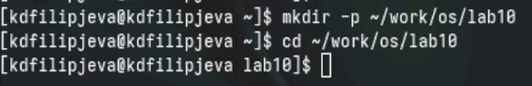
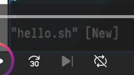
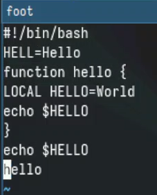
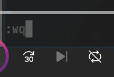
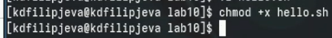
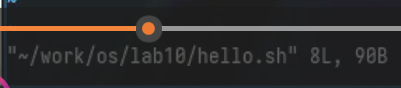
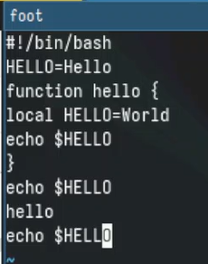

---
## Front matter
title: "Отчет о выполнении лабораторной работы"
subtitle: "Лабораторная работа №10"
author: "Филипьева Ксения Дмитриевна"

## Generic otions
lang: ru-RU
toc-title: "Содержание"

## Bibliography
bibliography: bib/cite.bib
csl: pandoc/csl/gost-r-7-0-5-2008-numeric.csl

## Pdf output format
toc: true # Table of contents
toc-depth: 2
lof: true # List of figures
lot: true # List of tables
fontsize: 12pt
linestretch: 1.3
papersize: a4
documentclass: scrreprt
## I18n polyglossia
polyglossia-lang:
  name: russian
  options:
	- spelling=modern
	- babelshorthands=true
polyglossia-otherlangs:
  name: english
## I18n babel
babel-lang: russian
babel-otherlangs: english
## Fonts
mainfont: PT Serif
romanfont: PT Serif
sansfont: PT Sans
monofont: PT Mono
mainfontoptions: Ligatures=TeX
romanfontoptions: Ligatures=TeX
sansfontoptions: Ligatures=TeX,Scale=MatchLowercase
monofontoptions: Scale=MatchLowercase,Scale=0.9
## Biblatex
biblatex: true
biblio-style: "gost-numeric"
biblatexoptions:
  - parentracker=true
  - backend=biber
  - hyperref=auto
  - language=auto
  - autolang=other*
  - citestyle=gost-numeric
## Pandoc-crossref LaTeX customization
figureTitle: "Рис."
tableTitle: "Таблица"
listingTitle: "Листинг"
lofTitle: "Список иллюстраций"
lotTitle: "Список таблиц"
lolTitle: "Листинги"
## Misc options
indent: true
header-includes:
  - \usepackage{indentfirst}
  - \usepackage{float} # keep figures where there are in the text
  - \floatplacement{figure}{H} # keep figures where there are in the text
---

# Цель работы

Познакомиться с операционной системой Linux. Получить практические навыки работы с редактором vi, установленным по умолчанию практически во всех дистрибутивах.

# Задание

Приобрести и отработать уже имеющиеся навыки по работе с редактором vi.

# Выполнение лабораторной работы

Создадим и перейдем в новый каталог (рис. [-@fig:1]).

{#fig:1 width=100%}

Откроем созданный файл через редактор vi (рис. [-@fig:2]).

{#fig:2 width=100%}

Вставим необходимый нам текст (рис. [-@fig:3]).

{#fig:3 width=100%}

После того, как вставили текст, запишем его и выйдем из файла с помощью комбинации ":wq"(рис. [-@fig:4]).

{#fig:4 width=100%}

Сделаем файл исполняемым(рис. [-@fig:5]).

{#fig:5 width=100%}

Зайдем заново в файл(рис. [-@fig:6]).

{#fig:6 width=100%}

Введем необходимые изменения и сохраним (рис. [-@fig:7]).

{#fig:7 width=100%}

# Выводы

Мы получили новые и отработали уже имеющиеся навыки работы с редактором vi

# Ответы на вопросы

1. Режимы работы vi: командный режим (перемещение курсора, команды редактирования), режим ввода (вставка и замена текста), режим последней строки (команды сохранения, выхода и т.д.).

2. Чтобы выйти без сохранения изменений, в командном режиме нажать :q! 

3. Команды позиционирования: h (влево), j (вниз), k (вверх), l (вправо), w (вперед на слово), b (назад на слово), 0 (начало строки), $ (конец строки).

4. Слово в vi - последовательность букв, цифр и знака подчеркивания, разделенная пробелами или знаками пунктуации.

5. Перейти в начало файла - gg, в конец файла - G.

6. Группы команд редактирования: удаление (x, dd), копирование (yy), вставка (p), замена (r, cw).

7. Чтобы заполнить строку символами $, нажать Esc (перейти в командный режим), затем 80i$Esc.

8. Отменить последнее действие редактирования - u. 

9. Группы команд режима последней строки: сохранение (:w), выход (:q), поиск с заменой (:%s/old/new/g).

10. Определить позицию конца строки - $

11. Опции vi задаются в файле .exrc. Их несколько десятков, узнать назначение можно в документации (man vi).

12. Режим работы vi определяется по внешнему виду курсора и поведению редактора.

13. 
    Командный режим <--> Режим ввода
           |                 |
           |                 |
           v                 v
       Режим последней строки

