---
## Front matter
lang: ru-RU
title: Лабораторная работа №11
subtitle: Презентация
author:
  - Филипьева К.Д.
institute:
  - Российский университет дружбы народов, Москва, Россия
date: 20 апреля 2024

## i18n babel
babel-lang: russian
babel-otherlangs: english

## Formatting pdf
toc: false
toc-title: Содержание
slide_level: 2
aspectratio: 169
section-titles: true
theme: metropolis
header-includes:
 - \metroset{progressbar=frametitle,sectionpage=progressbar,numbering=fraction}
 - '\makeatletter'
 - '\beamer@ignorenonframefalse'
 - '\makeatother'
 
## Fonts
mainfont: PT Serif
romanfont: PT Serif
sansfont: PT Sans
monofont: PT Mono
mainfontoptions: Ligatures=TeX
romanfontoptions: Ligatures=TeX
sansfontoptions: Ligatures=TeX,Scale=MatchLowercase
monofontoptions: Scale=MatchLowercase,Scale=0.9
---

# Информация

## Докладчик

:::::::::::::: {.columns align=center}
::: {.column width="70%"}

  * Филипьева Ксения Дмитриевна
  * Студент
  * Российский университет дружбы народов
  * [1132230795@pfur.ru](mailto:1132230795@pfur.ru)

:::
::: {.column width="30%"}

:::
::::::::::::::

## Цель

Познакомиться с операционной системой Linux. Получить практические навыки работы с редактором vi, установленным по умолчанию практически во всех дистрибутивах.

## Задачи

1. Открыть emacs.
2. Создать файл lab07.sh с помощью комбинации Ctrl-x Ctrl-f (C-x C-f).
3. Наберите текст:
4. Сохранить файл с помощью комбинации Ctrl-x Ctrl-s (C-x C-s).

## Задачи

5. Проделать с текстом стандартные процедуры редактирования, каждое действие должно осуществляться комбинацией клавиш.
5.1. Вырезать одной командой целую строку (С-k).
5.2. Вставить эту строку в конец файла (C-y).
5.3. Выделить область текста (C-space).
5.4. Скопировать область в буфер обмена (M-w).
5.5. Вставить область в конец файла.
5.6. Вновь выделить эту область и на этот раз вырезать её (C-w).
5.7. Отмените последнее действие (C-/).

## Задачи

6. Научитесь использовать команды по перемещению курсора.
6.1. Переместите курсор в начало строки (C-a).
6.2. Переместите курсор в конец строки (C-e).
6.3. Переместите курсор в начало буфера (M-<).
6.4. Переместите курсор в конец буфера (M->).

## Задачи

7. Управление буферами.
7.1. Вывести список активных буферов на экран (C-x C-b)
7.2. Переместитесь во вновь открытое окно (C-x) o со списком открытых буферов
и переключитесь на другой буфер.
7.3. Закройте это окно (C-x 0).
7.4. Теперь вновь переключайтесь между буферами, но уже без вывода их списка на
экран (C-x b).

## Задачи

8. Управление окнами.
8.1. Поделите фрейм на 4 части: разделите фрейм на два окна по вертикали (C-x 3),
а затем каждое из этих окон на две части по горизонтали (C-x 2) 
8.2. В каждом из четырёх созданных окон откройте новый буфер (файл) и введите
несколько строк текста.

## Задачи

9. Режим поиска
9.1. Переключитесь в режим поиска (C-s) и найдите несколько слов, присутствующих
в тексте.
9.2. Переключайтесь между результатами поиска, нажимая C-s.
9.3. Выйдите из режима поиска, нажав C-g.
9.4. Перейдите в режим поиска и замены (M-%), введите текст, который следует найти
и заменить, нажмите Enter , затем введите текст для замены. После того как будут
подсвечены результаты поиска, нажмите ! для подтверждения замены.
9.5. Испробуйте другой режим поиска, нажав M-s o. Объясните, чем он отличается от
обычного режима?

## Установка редактора

Установим редактор emacs, поскольку изначально он не был установлен в системе

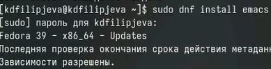{height=50%}

## Создание файла

Создадим файл lab07.sh

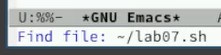{height=50%}

## Вставленный текст

Вставим в него необходимый текст

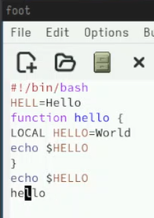{height=50%}

## Вырезание строки

Проделанные действия: вырезать строку, вставить строку, выделить область текста, вставить выделенную область текста, отменить последнее действие

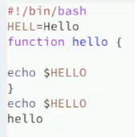{height=50%}

## Вставка строки

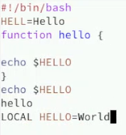{height=50%}

## Выделение области текста

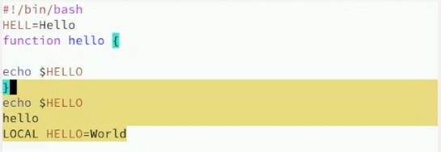{height=50%}

## Вставка выделенной области текста

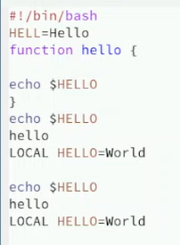{height=50%}

## Доступные буферы 

Вывод списка активных буферов на экран

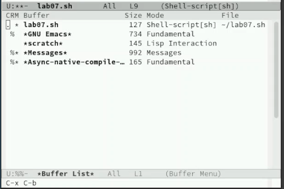{height=50%}

## Перемещение между буферами посредством командной строки

Перемещение между буферами без открытия меню

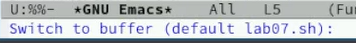{height=50%}

## Разбиение на 4 буфера

Организация 4-х буферов на экране 

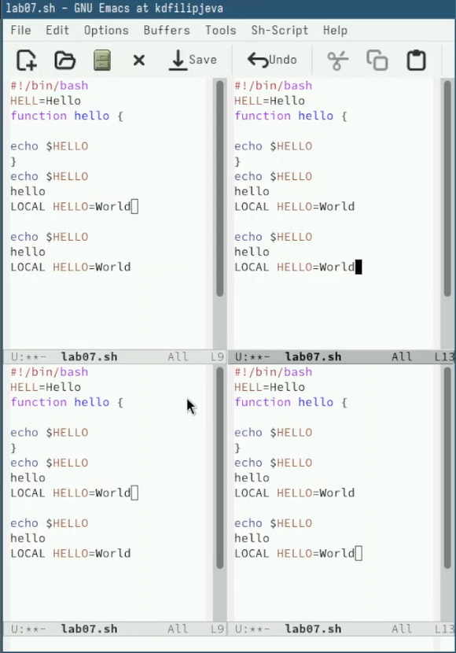{height=50%}

## Новые файлы в буфере

Созданные новые файлы в каждом из буферов 

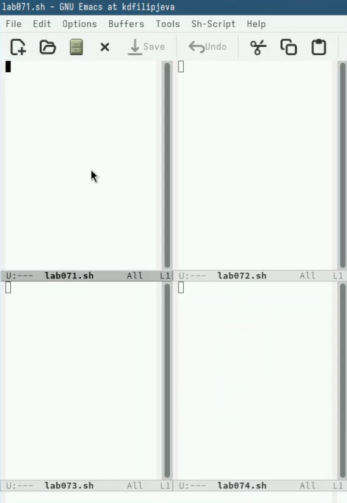{height=50%}

## Текст в буферах

Случайный текст в каждом из новых файлов

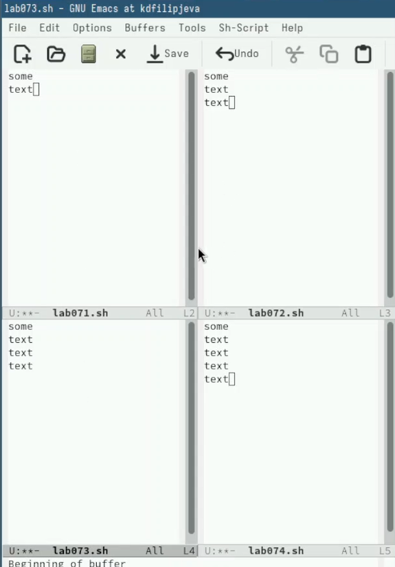{height=50%}

## Поиск текста

Поиск текста

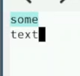{height=50%}

## Поиск текста при замене

Поиск текста при замене

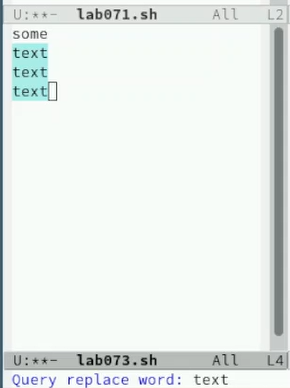{height=50%}

## Замена текста

Замена искомого текста

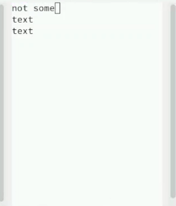{height=50%}

## Выводы

Мы получили новые и отработали уже имеющиеся навыки работы с редактором emacs

