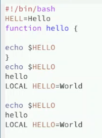
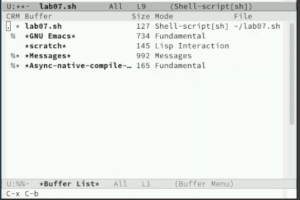

---
## Front matter
title: "Отчет о выполнении лабораторной работы"
subtitle: "Лабораторная работа №11"
author: "Филипьева Ксения Дмитриевна"

## Generic otions
lang: ru-RU
toc-title: "Содержание"

## Bibliography
bibliography: bib/cite.bib
csl: pandoc/csl/gost-r-7-0-5-2008-numeric.csl

## Pdf output format
toc: true # Table of contents
toc-depth: 2
lof: true # List of figures
lot: true # List of tables
fontsize: 12pt
linestretch: 1.3
papersize: a4
documentclass: scrreprt
## I18n polyglossia
polyglossia-lang:
  name: russian
  options:
	- spelling=modern
	- babelshorthands=true
polyglossia-otherlangs:
  name: english
## I18n babel
babel-lang: russian
babel-otherlangs: english
## Fonts
mainfont: PT Serif
romanfont: PT Serif
sansfont: PT Sans
monofont: PT Mono
mainfontoptions: Ligatures=TeX
romanfontoptions: Ligatures=TeX
sansfontoptions: Ligatures=TeX,Scale=MatchLowercase
monofontoptions: Scale=MatchLowercase,Scale=0.9
## Biblatex
biblatex: true
biblio-style: "gost-numeric"
biblatexoptions:
  - parentracker=true
  - backend=biber
  - hyperref=auto
  - language=auto
  - autolang=other*
  - citestyle=gost-numeric
## Pandoc-crossref LaTeX customization
figureTitle: "Рис."
tableTitle: "Таблица"
listingTitle: "Листинг"
lofTitle: "Список иллюстраций"
lotTitle: "Список таблиц"
lolTitle: "Листинги"
## Misc options
indent: true
header-includes:
  - \usepackage{indentfirst}
  - \usepackage{float} # keep figures where there are in the text
  - \floatplacement{figure}{H} # keep figures where there are in the text
---

# Цель работы

Познакомиться с операционной системой Linux. Получить практические навыки работы с редактором Emacs.

# Задание

Приобрести и отработать уже имеющиеся навыки по работе с редактором emacs.

# Выполнение лабораторной работы

Установим редактор emacs, поскольку изначально он не был установлен в системе (рис. [-@fig:1]).

{#fig:1 width=100%}

Создадим файл lab07.sh (рис. [-@fig:2]).

{#fig:2 width=100%}

Вставим в него необходимый текст (рис. [-@fig:3]).

{#fig:3 width=100%}

Проделанные действия: вырезать строку, вставить строку, выделить область текста, вставить выделенную область текста, отменить последнее действие (рис. [-@fig:4]),(рис. [-@fig:5]),(рис. [-@fig:6]),(рис. [-@fig:7]).

{#fig:4 width=100%}

{#fig:5 width=100%}

{#fig:6 width=100%}

{#fig:7 width=100%}

Вывод списка активных буферов на экран (рис. [-@fig:8]).

{#fig:8 width=100%}

Перемещение между буферами без открытия меню (рис. [-@fig:9]).

{#fig:9 width=100%}

Организация 4-х буферов на экране (рис. [-@fig:10]).

{#fig:10 width=100%}

Созданные новые файлы в каждом из буферов (рис. [-@fig:11]).

{#fig:11 width=100%}

Случайный текст в каждом из новых файлов (рис. [-@fig:12]).

{#fig:12 width=100%}

Поиск текста (рис. [-@fig:13]).

{#fig:13 width=100%}

Поиск текста при замене (рис. [-@fig:14]).

{#fig:14 width=100%}

Замена текста (рис. [-@fig:15]).

{#fig:15 width=100%}

# Выводы

Мы получили новые и отработали уже имеющиеся навыки работы с редактором emacs

# Ответы на вопросы

1. Emacs - это мощный текстовый редактор, разработанный Ричардом Столлманом. Он предлагает широкий спектр возможностей, включая редактирование текста, управление файлами, интеграцию с различными программами и многое другое.

2. Некоторые особенности Emacs, которые могут сделать его сложным для освоения новичком, включают:
   - Большое количество клавиатурных сочетаний (комбинации клавиш)
   - Нетривиальная навигация и управление буферами
   - Необходимость изучения основных концепций, таких как режимы, расширения и настройка конфигурации

3. В Emacs:
   - Буфер - это область памяти, в которой хранится текст, с которым вы работаете.
   - Окно - это область на экране, в которой отображается содержимое буфера.

4. Да, в Emacs можно открыть более 10 буферов в одном окне. Emacs поддерживает множественные буферы и переключение между ними.

5. При запуске Emacs по умолчанию создаются следующие буферы:
   - *scratch* - буфер для экспериментов и временных заметок
   - *Messages* - буфер, в котором отображаются сообщения Emacs

6. Чтобы ввести комбинации клавиш:
   - C-c | - нажмите Ctrl+c, затем нажмите |
   - C-c C-| - нажмите Ctrl+c, затем Ctrl+|

7. Чтобы поделить текущее окно на две части, используйте команду `split-window-horizontally` (C-x 2).

8. Настройки редактора Emacs хранятся в файле `.emacs` (или `init.el`) в домашнем каталоге пользователя.

9. Клавиша `i` в Emacs по умолчанию переводит редактор в режим вставки (insert mode). Эту клавишу можно переназначить на другие функции при помощи настройки конфигурации.

10. Выбор между Emacs и Vi (Vim) - это вопрос личных предпочтений. Emacs может показаться более сложным для новичков, но он предлагает более богатый набор возможностей и расширений. Vi (Vim) более компактен и может быть предпочтительнее для некоторых пользователей. Оба редактора являются мощными инструментами, и выбор зависит от ваших потребностей и привычек.
