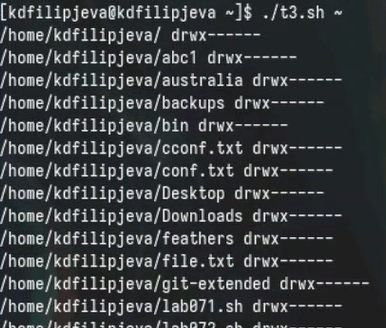

---
## Front matter
lang: ru-RU
title: Лабораторная работа №12
subtitle: Презентация
author:
  - Филипьева К.Д.
institute:
  - Российский университет дру##бы народов, Москва, Россия
date: 27 апреля 2024

## i18n babel
babel-lang: russian
babel-otherlangs: english

## Formatting pdf
toc: false
toc-title: Содер##ание
slide_level: 2
aspectratio: 169
section-titles: true
theme: metropolis
header-includes:
 - \metroset{progressbar=frametitle,sectionpage=progressbar,numbering=fraction}
 - '\makeatletter'
 - '\beamer@ignorenonframefalse'
 - '\makeatother'
 
## Fonts
mainfont: PT Serif
romanfont: PT Serif
sansfont: PT Sans
monofont: PT Mono
mainfontoptions: Ligatures=TeX
romanfontoptions: Ligatures=TeX
sansfontoptions: Ligatures=TeX,Scale=MatchLowercase
monofontoptions: Scale=MatchLowercase,Scale=0.9
---

# Информация

## Докладчик

:::::::::::::: {.columns align=center}
::: {.column width="70%"}

  * Филипьева Ксения Дмитриевна
  * Студент
  * Российский университет дру##бы народов
  * [1132230795@pfur.ru](mailto:1132230795@pfur.ru)

:::
::: {.column width="30%"}

:::
::::::::::::::

## Цель

Изучить основы программирования в оболочке ОС UNIX/Linux. Научиться писать небольшие командные файлы.

## Задачи

1. Написать скрипт, который при запуске будет делать резервную копию самого себя (то
есть файла, в котором содер##ится его исходный код) в другую директорию backup
в вашем домашнем каталоге. При этом файл дол##ен архивироваться одним из ар-
хиваторов на выбор zip, bzip2 или tar. Способ использования команд архивации
необходимо узнать, изучив справку.

## Задачи

2. Написать пример командного файла, обрабатывающего любое произвольное число
аргументов командной строки, в том числе превышающее десять. Например, скрипт
мо##ет последовательно распечатывать значения всех переданных аргументов.

## Задачи

3. Написать командный файл — аналог команды ls (без использования самой этой команды и команды dir). Требуется, чтобы он выдавал информацию о ну##ном каталоге
и выводил информацию о возмо##ностях доступа к файлам этого каталога.

## Задачи

4. Написать командный файл, который получает в качестве аргумента командной строки
формат файла (.txt, .doc, .jpg, .pdf и т.д.) и вычисляет количество таких файлов
в указанной директории. Путь к директории так##е передаётся в виде аргумента командной строки.

## Создание папки

Создадим папку в которую будут сохраняться бэк-апы для первого задания.

{height=50%}

## Создание файла

Создадим файл для первого задания и откроем его

{height=50%}

## Код задания

Впишем в него код, который позволит выполнять нам поставленные задачи

{height=50%}

## Выдача прав

Выдадим все права на файл и выполним его (тут я забыла сделать скрин вывода, но архив создался в папке)

{height=50%}

## Создание файла

Создадим файл для второго задания и откроем его

{height=50%}

## Код для задания

Впишем в него код, который позволит выполнять нам поставленные задачи

{height=50%}

## Работоспособность кода №2

Работоспособность кода

{height=50%}

## Создание файла

Создадим файл для третьего задания и откроем его

{height=50%}

## Код для задания

Впишем в него код, который позволит выполнять нам поставленные задачи

{height=50%}

## Работоспособность кода №3

Работоспособность кода

{height=50%}

## Создание файла

Создадим файл для четвертого задания и откроем его

{height=50%}

## Код задания

Впишем в него код, который позволит выполнять нам поставленные задачи

{height=50%}

## Работоспособность кода №4

Работоспособность кода

{height=50%}

## Выводы

Мы получили новые и отработали у##е имеющиеся навыки программирования в оболочке OC Linux.

