---
## Front matter
title: "Отчет о выполнении лабораторной работы"
subtitle: "Лабораторная работа №12"
author: "Филипьева Ксения Дмитриевна"

## Generic otions
lang: ru-RU
toc-title: "Содержание"

## Bibliography
bibliography: bib/cite.bib
csl: pandoc/csl/gost-r-7-0-5-2008-numeric.csl

## Pdf output format
toc: true # Table of contents
toc-depth: 2
lof: true # List of figures
lot: true # List of tables
fontsize: 12pt
linestretch: 1.3
papersize: a4
documentclass: scrreprt
## I18n polyglossia
polyglossia-lang:
  name: russian
  options:
	- spelling=modern
	- babelshorthands=true
polyglossia-otherlangs:
  name: english
## I18n babel
babel-lang: russian
babel-otherlangs: english
## Fonts
mainfont: PT Serif
romanfont: PT Serif
sansfont: PT Sans
monofont: PT Mono
mainfontoptions: Ligatures=TeX
romanfontoptions: Ligatures=TeX
sansfontoptions: Ligatures=TeX,Scale=MatchLowercase
monofontoptions: Scale=MatchLowercase,Scale=0.9
## Biblatex
biblatex: true
biblio-style: "gost-numeric"
biblatexoptions:
  - parentracker=true
  - backend=biber
  - hyperref=auto
  - language=auto
  - autolang=other*
  - citestyle=gost-numeric
## Pandoc-crossref LaTeX customization
figureTitle: "Рис."
tableTitle: "Таблица"
listingTitle: "Листинг"
lofTitle: "Список иллюстраций"
lotTitle: "Список таблиц"
lolTitle: "Листинги"
## Misc options
indent: true
header-includes:
  - \usepackage{indentfirst}
  - \usepackage{float} # keep figures where there are in the text
  - \floatplacement{figure}{H} # keep figures where there are in the text
---

# Цель работы

Изучить основы программирования в оболочке ОС UNIX/Linux. Научиться писать небольшие командные файлы.

# Задание

Приобрести и отработать уже имеющиеся навыки программирования в оболочке ОС Linux.

# Выполнение лабораторной работы

Создадим папку в которую будут сохраняться бэк-апы для первого задания. (рис. [-@fig:1]).

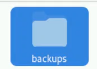{#fig:1 width=100%}

Создадим файл для первого задания и откроем его (рис. [-@fig:2]).

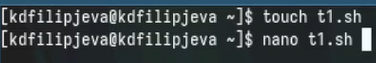{#fig:2 width=100%}

Впишем в него код, который позволит выполнять нам поставленные задачи (рис. [-@fig:3]).

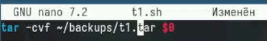{#fig:3 width=100%}

Выдадим все права на файл и выполним его (тут я забыла сделать скрин вывода, но архив создался в папке) (рис. [-@fig:4]).

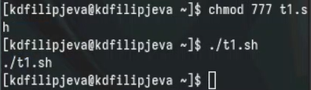{#fig:4 width=100%}

Создадим файл для второго задания, выдадим все права и откроем его для редактирования (рис. [-@fig:5]).

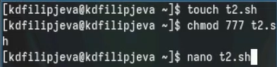{#fig:5 width=100%}

Впишем в него код, позволяющий выполнить поставленное задание (рис. [-@fig:6]).

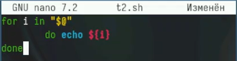{#fig:6 width=100%}

Работоспособность кода (рис. [-@fig:7]).

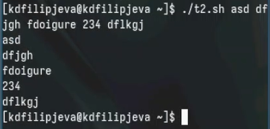{#fig:7 width=100%}

Создадим файл для третьего задания, выдадим все права и откроем его для редактирования (рис. [-@fig:8]).

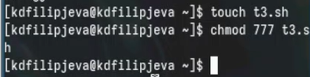{#fig:8 width=100%}

Впишем в него код, позволяющий выполнить поставленное задание (рис. [-@fig:9]).

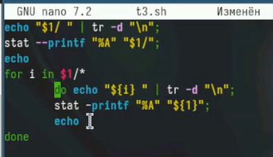{#fig:9 width=100%}

Работоспособность кода (рис. [-@fig:10]).

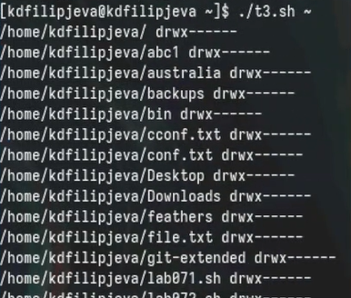{#fig:10 width=100%}

Создадим файл для четвертого задания, выдадим все права и откроем его для редактирования (рис. [-@fig:11]).

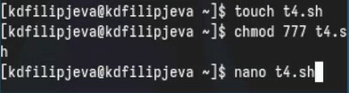{#fig:11 width=100%}

Впишем в него код, позволяющий выполнить поставленное задание (рис. [-@fig:12]).

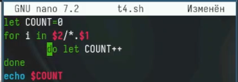{#fig:12 width=100%}

Работоспособность кода (рис. [-@fig:13]).

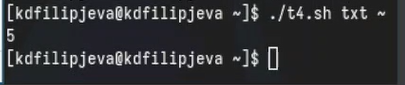{#fig:13 width=100%}

# Выводы

Мы получили новые и отработали уже имеющиеся навыки программирования в оболочке ОС Linux.

# Ответы на вопросы

1. Командная оболочка (shell) - это программа, которая обеспечивает интерфейс для взаимодействия пользователя с операционной системой. Примеры: Bash (Bourne Again Shell), Zsh (Z shell), Fish (Friendly Interactive Shell). Они отличаются синтаксисом, встроенными функциями, расширенными возможностями автодополнения и настройками.

2. POSIX (Portable Operating System Interface) - это набор стандартов, определяющих интерфейсы между операционной системой и прикладными программами для обеспечения переносимости.

3. Переменные в Bash определяются как `имя=значение`. Массивы определяются как `имя=(значение1 значение2 ...)` или `имя[индекс]=значение`.

4. `let` позволяет выполнять арифметические операции, а `read` считывает ввод пользователя и сохраняет его в переменной.

5. Bash поддерживает основные арифметические операции: сложение (+), вычитание (-), умножение (*), деление (/), остаток от деления (%), возведение в степень (**).

6. Операция `(( ))` используется для выполнения арифметических операций и сравнений.

7. Стандартные переменные: `HOME` (домашний каталог), `PATH` (список каталогов для поиска команд), `USER` (имя текущего пользователя) и др.

8. Метасимволы - это специальные символы, имеющие особое значение для командной оболочки (например, `*`, `?`, `[`, `]`).

9. Метасимволы экранируются с помощью обратного слэша `\` или заключаются в кавычки.

10. Командные файлы создаются в текстовом редакторе и сохраняются с расширением `.sh`. Запуск: `bash имя_файла.sh` или `./имя_файла.sh` (при наличии прав на исполнение).

11. Функции в Bash определяются как `имя_функции() { команды; }`.

12. Для проверки типа файла используется команда `test` или `[`: `[ -d файл ]` (каталог) или `[ -f файл ]` (обычный файл).

13. `set` устанавливает опции командной оболочки, `typeset` объявляет переменные и их атрибуты, `unset` удаляет переменные или функции.

14. Параметры передаются в командные файлы через аргументы командной строки, доступные как `$1`, `$2` и т.д.

15. Специальные переменные Bash: `$0` (имя скрипта), `$#` (количество аргументов), `$@` (все аргументы в виде отдельных слов), `$*` (все аргументы в виде одной строки), `$$` (PID текущего процесса) и др.
