---
## Front matter
lang: ru-RU
title: Лабораторная работа №13
subtitle: Презентация
author:
  - Филипьева К.Д.
institute:
  - Российский университет дру##бы народов, Москва, Россия
date: 04 мая 2024

## i18n babel
babel-lang: russian
babel-otherlangs: english

## Formatting pdf
toc: false
toc-title: Содер##ание
slide_level: 2
aspectratio: 169
section-titles: true
theme: metropolis
header-includes:
 - \metroset{progressbar=frametitle,sectionpage=progressbar,numbering=fraction}
 - '\makeatletter'
 - '\beamer@ignorenonframefalse'
 - '\makeatother'
 
## Fonts
mainfont: PT Serif
romanfont: PT Serif
sansfont: PT Sans
monofont: PT Mono
mainfontoptions: Ligatures=TeX
romanfontoptions: Ligatures=TeX
sansfontoptions: Ligatures=TeX,Scale=MatchLowercase
monofontoptions: Scale=MatchLowercase,Scale=0.9
---

# Информация

## Докладчик

:::::::::::::: {.columns align=center}
::: {.column width="70%"}

  * Филипьева Ксения Дмитриевна
  * Студент
  * Российский университет дру##бы народов
  * [1132230795@pfur.ru](mailto:1132230795@pfur.ru)

:::
::: {.column width="30%"}

:::
::::::::::::::

## Цель

Изучить основы программирования в оболочке ОС UNIX. Научится писать более сложные командные файлы с использованием логических управляющих конструкций и циклов.

## Задачи

1. Используя команды getopts grep, написать командный файл, который анализирует
командную строку с ключами:
– -iinputfile — прочитать данные из указанного файла;
– -ooutputfile — вывести данные в указанный файл;
– -pшаблон — указать шаблон для поиска;
– -C — различать большие и малые буквы;
– -n — выдавать номера строк.
а затем ищет в указанном файле нужные строки, определяемые ключом -p.

## Задачи

2. Написать на языке Си программу, которая вводит число и определяет, является ли оно
больше нуля, меньше нуля или равно нулю. Затем программа завершается с помощью
функции exit(n), передавая информацию в о коде завершения в оболочку. Команд-
ный файл должен вызывать эту программу и, проанализировав с помощью команды
$?, выдать сообщение о том, какое число было введено.

## Задачи

3. Написать командный файл, создающий указанное число файлов, пронумерованных
последовательно от 1 до 𝑁 (например 1.tmp, 2.tmp, 3.tmp,4.tmp и т.д.). Число файлов,
которые необходимо создать, передаётся в аргументы командной строки. Этот же ко-
мандный файл должен уметь удалять все созданные им файлы (если они существуют).

## Задачи

4. Написать командный файл, который с помощью команды tar запаковывает в архив
все файлы в указанной директории. Модифицировать его так, чтобы запаковывались
только те файлы, которые были изменены менее недели тому назад (использовать
команду find).

## Первое задание

Создадим файл для первого задания

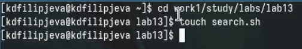{height=50%}

## Промежуточный результат

Введем в него код для первого задания

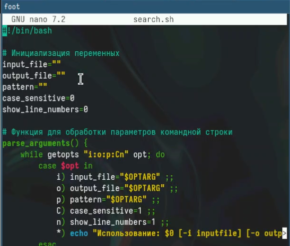{height=50%}

## Промежуточный результат

Создадим файл в который будем вводить текст, с которым будет работать программа

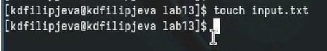{height=50%}

## Промежуточный результат

Текст для работы программы

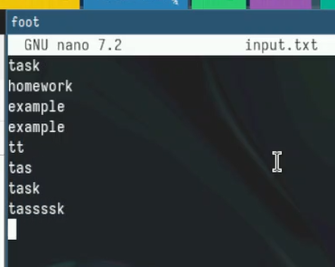{height=50%}

## Промежуточный результат

Вывод найденного текста по установленному шаблону в командную строку

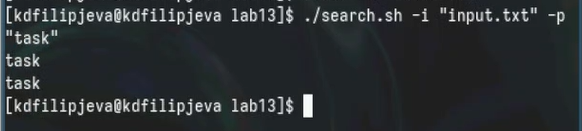{height=50%}

## Промежуточный результат

Выведем найденный текст в отдельный файл

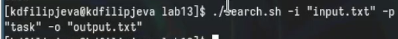{height=50%}

## Промежуточный результат

Выведенный текст в отдельном файле

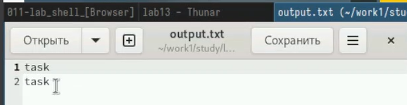{height=50%}

## Промежуточный результат

Отредактируем текст для работы программы

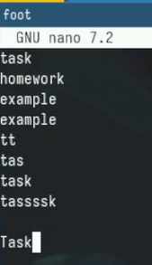{height=50%}

## Промежуточный результат

Выведем текст в файл с учетом регистра

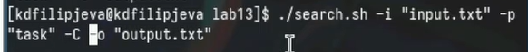{height=50%}

## Промежуточный результат

Вывод текста с учетом регистра( видно, что вывело только с маленькой буквы, а заглавную не тронуло)

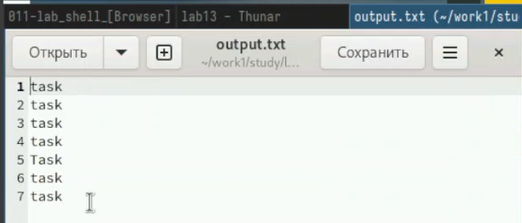{height=50%}

## Промежуточный результат

Выведем текст с учетом регистра и нумерацией строк, из которых было взято слово

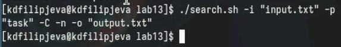{height=50%}

## Промежуточный результат

Вывод текста с нумерацией

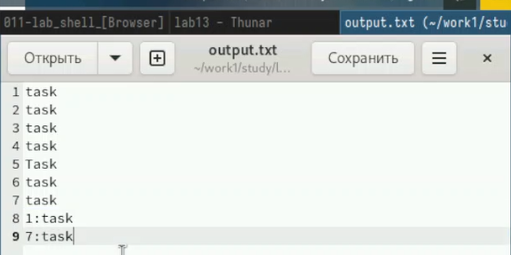{height=50%}

## Второе задание

Создадим файл для второго задания и выдадим права на выполнение

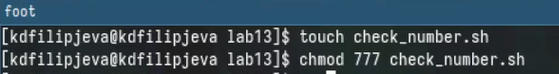{height=50%}

## Промежуточный результат

Вставим код программы, который ответственнен за определение числа

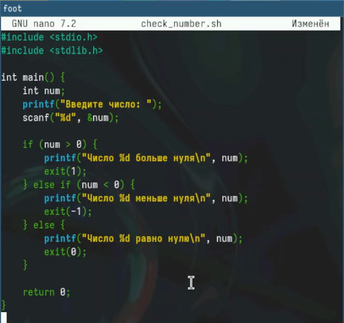{height=50%}

## Промежуточный результат

Создадим файл для второго задания, который будет "общаться с пользователем"

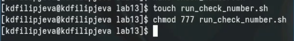{height=50%}

## Промежуточный результат

Вставим в него код программы

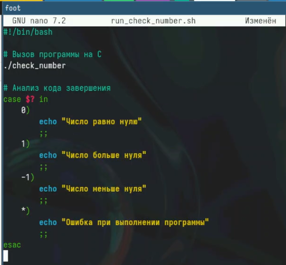{height=50%}

## Промежуточный результат

Скомпилируем наш код на языке Си и проверим работоспособность

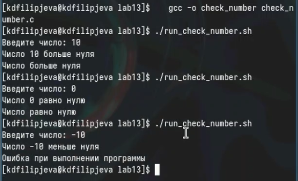{height=50%}

## Третье задание

Создадим файл для третьего задания и выдадим ему права на выполнение

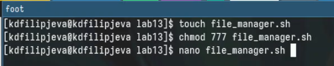{height=50%}

## Промежуточный результат

Вставим в него необходимый код для выполнения задания

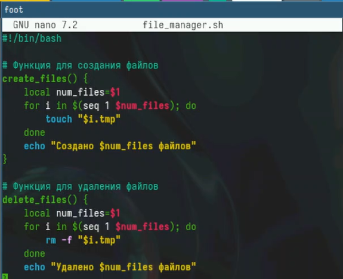{height=50%}

## Промежуточный результат

Работоспособность кода

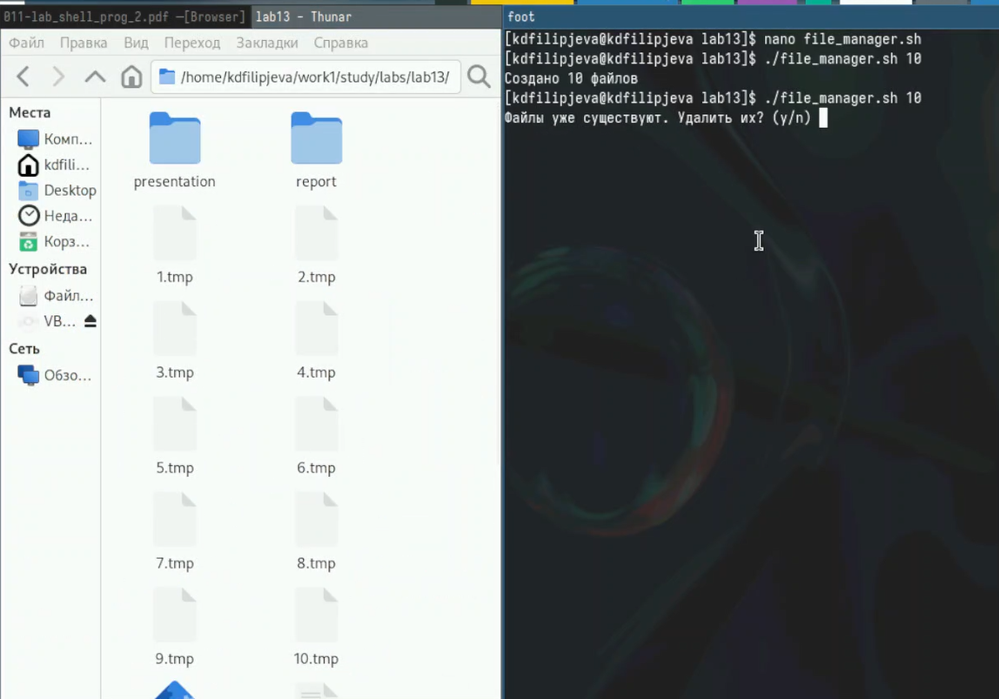{height=50%}

## Промежуточный результат

Работоспособность кода в обратную сторону

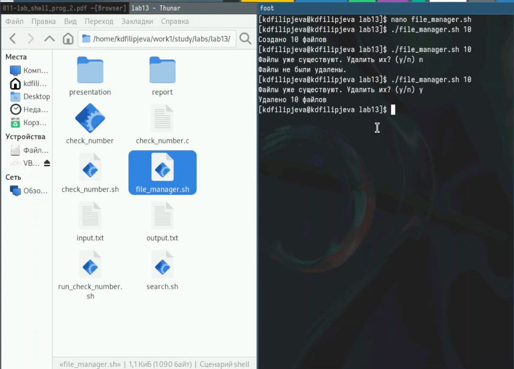{height=50%}

## Четвертое задание

Создадим файл для четвертого задания и выдадим ему права на выполнение

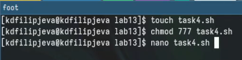{height=50%}

## Промежуточный результат

Вставим в него необходимый код программы 

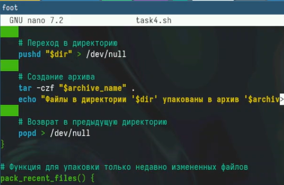{height=50%}

## Промежуточный результат

Работоспособность кода 

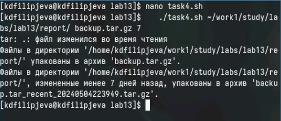{height=50%}

## Промежуточный результат

Созданные 2 архива: всей папки и только файлов, которые были изменены менее чем неделю назад 

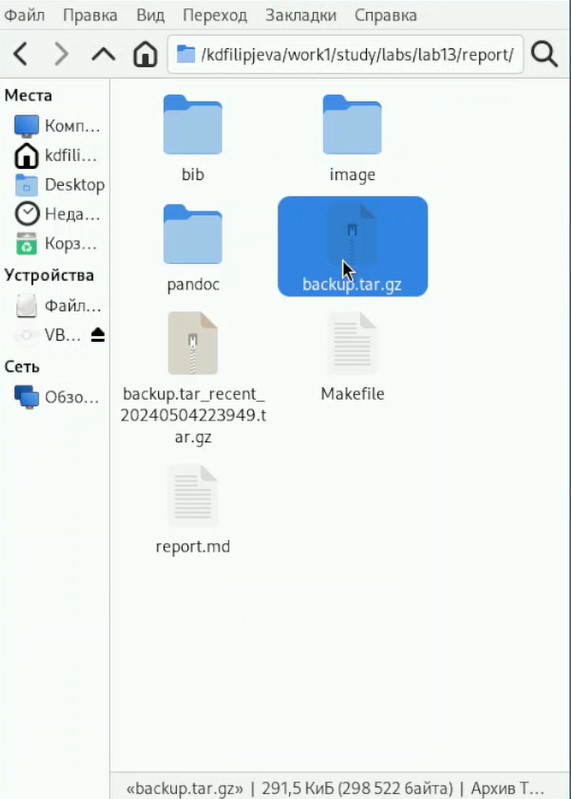{height=50%}

## Выводы

Мы получили новые и отработали у##е имеющиеся навыки программирования в оболочке OC Linux.

