---
## Front matter
title: "Отчет о выполнении лабораторной работы"
subtitle: "Лабораторная работа №13"
author: "Филипьева Ксения Дмитриевна"

## Generic otions
lang: ru-RU
toc-title: "Содержание"

## Bibliography
bibliography: bib/cite.bib
csl: pandoc/csl/gost-r-7-0-5-2008-numeric.csl

## Pdf output format
toc: true # Table of contents
toc-depth: 2
lof: true # List of figures
lot: true # List of tables
fontsize: 12pt
linestretch: 1.3
papersize: a4
documentclass: scrreprt
## I18n polyglossia
polyglossia-lang:
  name: russian
  options:
	- spelling=modern
	- babelshorthands=true
polyglossia-otherlangs:
  name: english
## I18n babel
babel-lang: russian
babel-otherlangs: english
## Fonts
mainfont: PT Serif
romanfont: PT Serif
sansfont: PT Sans
monofont: PT Mono
mainfontoptions: Ligatures=TeX
romanfontoptions: Ligatures=TeX
sansfontoptions: Ligatures=TeX,Scale=MatchLowercase
monofontoptions: Scale=MatchLowercase,Scale=0.9
## Biblatex
biblatex: true
biblio-style: "gost-numeric"
biblatexoptions:
  - parentracker=true
  - backend=biber
  - hyperref=auto
  - language=auto
  - autolang=other*
  - citestyle=gost-numeric
## Pandoc-crossref LaTeX customization
figureTitle: "Рис."
tableTitle: "Таблица"
listingTitle: "Листинг"
lofTitle: "Список иллюстраций"
lotTitle: "Список таблиц"
lolTitle: "Листинги"
## Misc options
indent: true
header-includes:
  - \usepackage{indentfirst}
  - \usepackage{float} # keep figures where there are in the text
  - \floatplacement{figure}{H} # keep figures where there are in the text
---

# Цель работы

Изучить основы программирования в оболочке ОС UNIX. Научится писать более сложные командные файлы с использованием логических управляющих конструкций и циклов.

# Задание

1. Используя команды getopts grep, написать командный файл, который анализирует
командную строку с ключами:
– -iinputfile — прочитать данные из указанного файла;
– -ooutputfile — вывести данные в указанный файл;
– -pшаблон — указать шаблон для поиска;
– -C — различать большие и малые буквы;
– -n — выдавать номера строк.
а затем ищет в указанном файле нужные строки, определяемые ключом -p.
2. Написать на языке Си программу, которая вводит число и определяет, является ли оно
больше нуля, меньше нуля или равно нулю. Затем программа завершается с помощью
функции exit(n), передавая информацию в о коде завершения в оболочку. Команд-
ный файл должен вызывать эту программу и, проанализировав с помощью команды
$?, выдать сообщение о том, какое число было введено.
3. Написать командный файл, создающий указанное число файлов, пронумерованных
последовательно от 1 до 𝑁 (например 1.tmp, 2.tmp, 3.tmp,4.tmp и т.д.). Число файлов,
которые необходимо создать, передаётся в аргументы командной строки. Этот же ко-
мандный файл должен уметь удалять все созданные им файлы (если они существуют).
4. Написать командный файл, который с помощью команды tar запаковывает в архив
все файлы в указанной директории. Модифицировать его так, чтобы запаковывались
только те файлы, которые были изменены менее недели тому назад (использовать
команду find).

# Выполнение лабораторной работы

Создадим файл для первого задания (рис. [-@fig:1]).

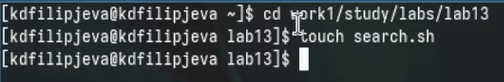{#fig:1 width=100%}

Введем в него код для первого задания (рис. [-@fig:2]).

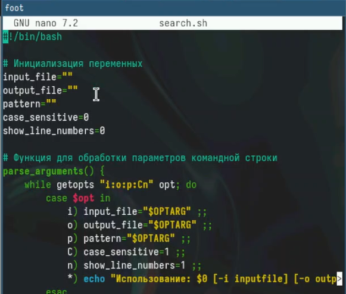{#fig:2 width=100%}

Создадим файл в который будем вводить текст, с которым будет работать программа (рис. [-@fig:3]).

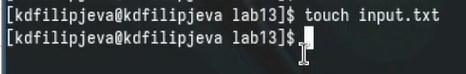{#fig:3 width=100%}

Текст для работы программы (рис. [-@fig:4]).

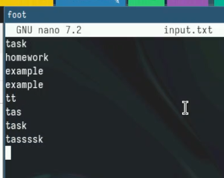{#fig:4 width=100%}

Вывод найденного текста по установленному шаблону в командную строку (рис. [-@fig:5]).

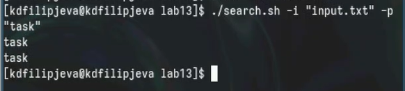{#fig:5 width=100%}

Выведем найденный текст в отдельный файл (рис. [-@fig:6]).

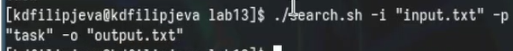{#fig:6 width=100%}

Выведенный текст в отдельном файле (рис. [-@fig:7]).

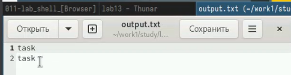{#fig:7 width=100%}

Отредактируем текст для работы программы (рис. [-@fig:8]).

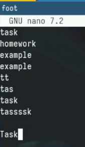{#fig:8 width=100%}

Выведем текст в файл с учетом регистра (рис. [-@fig:9]).

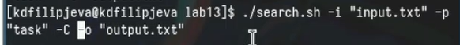{#fig:9 width=100%}

Вывод текста с учетом регистра( видно, что вывело только с маленькой буквы, а заглавную не тронуло) (рис. [-@fig:10]).

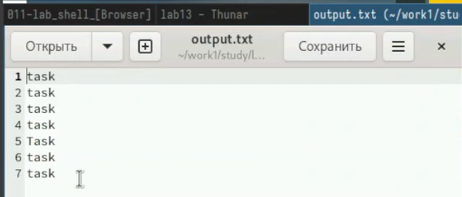{#fig:10 width=100%}

Выведем текст с учетом регистра и нумерацией строк, из которых было взято слово (рис. [-@fig:11]).

![вывод результата(image/1311.png){#fig:11 width=100%}

Вывод текста с нумерацией (рис. [-@fig:12]).

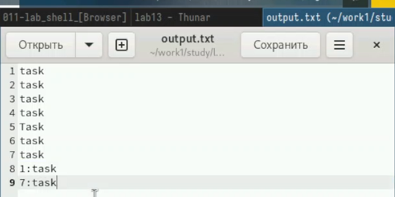{#fig:12 width=100%}

Создадим файл для второго задания и выдадим права на выполнение (рис. [-@fig:13]).

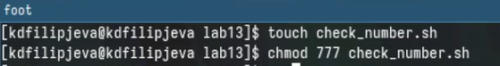{#fig:13 width=100%}

Вставим код программы, который ответственнен за определение числа (рис. [-@fig:14]).

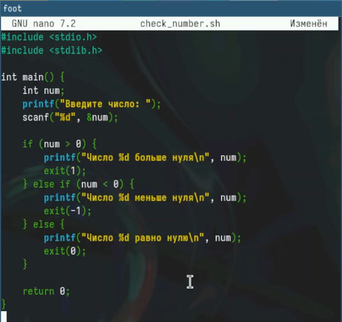{#fig:14 width=100%}

Создадим файл для второго задания, который будет "общаться с пользователем" (рис. [-@fig:15]).

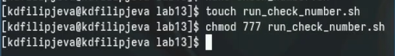{#fig:15 width=100%}

Вставим в него код программы (рис. [-@fig:16]).

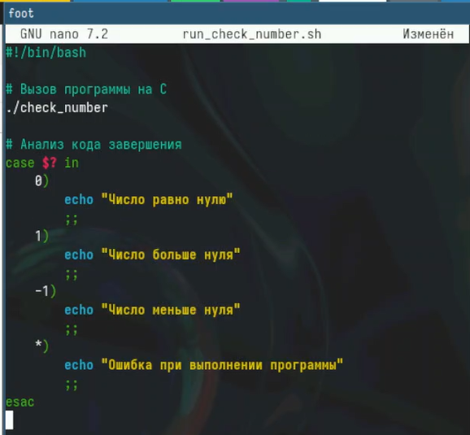{#fig:16 width=100%}

Скомпилируем наш код на языке Си и проверим работоспособность (рис. [-@fig:17]).

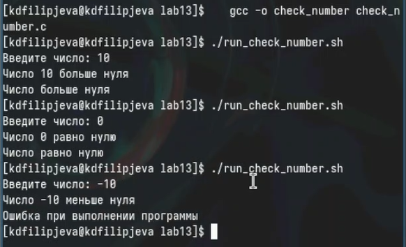{#fig:17 width=100%}

Создадим файл для третьего задания и выдадим ему права на выполнение (рис. [-@fig:18]).

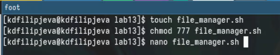{#fig:18 width=100%}

Вставим в него необходимый код для выполнения задания (рис. [-@fig:19]).

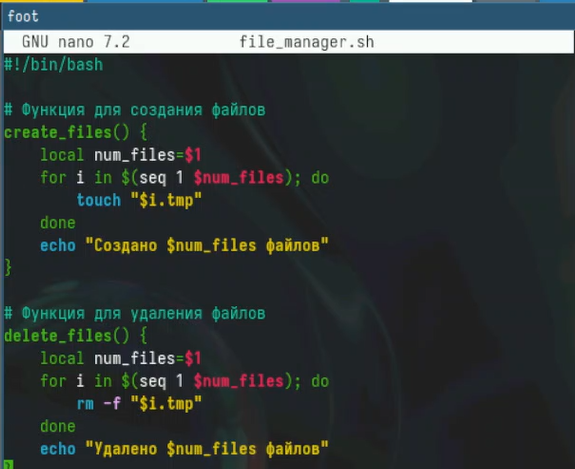{#fig:19 width=100%}

Работоспособность кода (рис. [-@fig:20]).

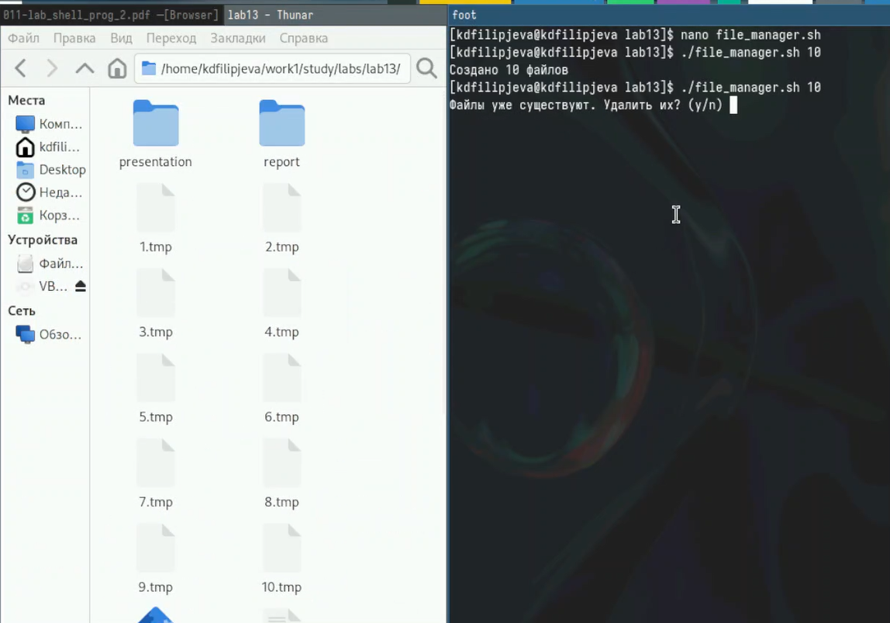{#fig:20 width=100%}

Работоспособность кода в обратную сторону (рис. [-@fig:21]).

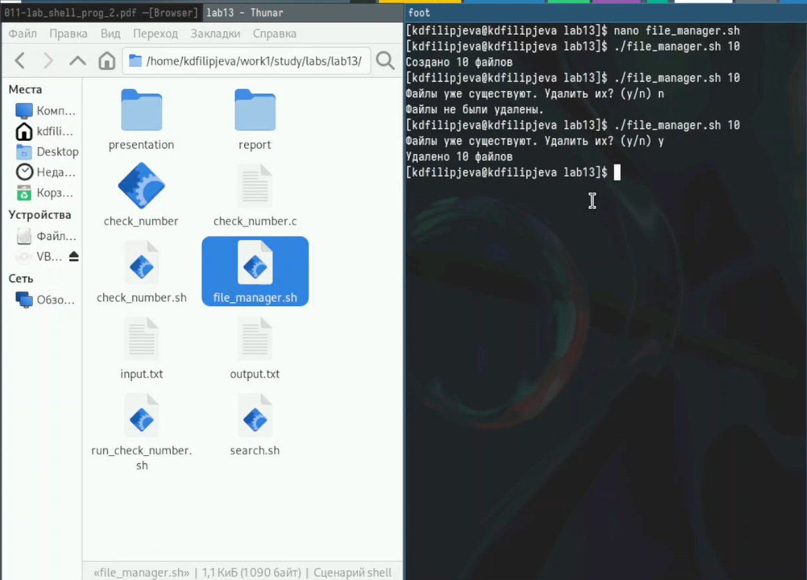{#fig:21 width=100%}

Создадим файл для четвертого задания и выдадим ему права на выполнение (рис. [-@fig:22]).

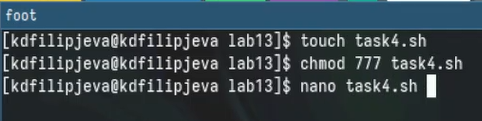{#fig:22 width=100%}

Вставим в него необходимый код программы (рис. [-@fig:23]).

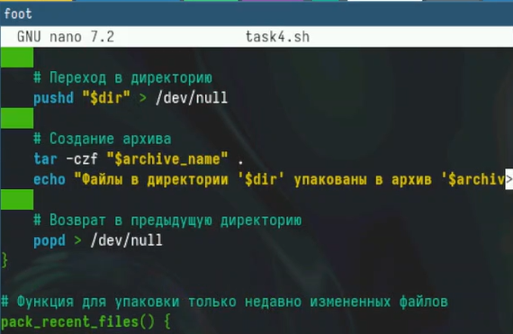{#fig:23 width=100%}

Работоспособность кода (рис. [-@fig:24]).

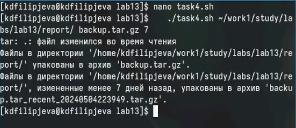{#fig:24 width=100%}

Созданные 2 архива: всей папки и только файлов, которые были изменены менее чем неделю назад (рис. [-@fig:25]).

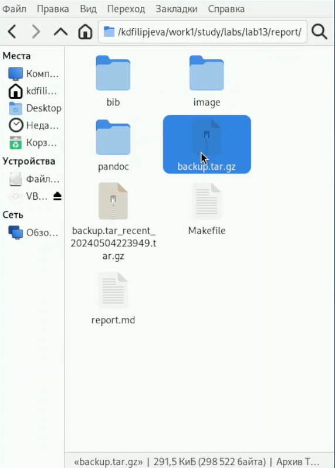{#fig:25 width=100%}

# Выводы

Мы получили новые и отработали уже имеющиеся навыки программирования в оболочке ОС Linux.

# Ответы на вопросы

1. Команда getopts используется для разбора параметров командной строки в скриптах Bash. Она позволяет легко обрабатывать флаги и аргументы, переданные пользователем при запуске скрипта.

2. Метасимволы, такие как *, ?, [], используются в командной строке для создания шаблонов имен файлов. Они позволяют быстро и гибко генерировать списки файлов, соответствующих определенным критериям.

3. Основные операторы управления действиями в Bash:
   - if-then-else-fi - для условного выполнения команд
   - case-esac - для многовариантного выбора
   - for-do-done - для итерации по списку значений
   - while-do-done - для выполнения команд, пока условие истинно
   - until-do-done - для выполнения команд, пока условие ложно

4. Для прерывания цикла в Bash используются:
   - break - для выхода из текущего цикла
   - continue - для перехода к следующей итерации цикла

5. Команды false и true возвращают соответственно ложное (1) и истинное (0) значение, которое можно использовать в управляющих конструкциях.

6. Строка if test -f man$s/$i.$s проверяет, существует ли файл с именем, сформированным из переменных $s и $i. Если файл существует (`-f`), то выполняются дальнейшие действия.

7. Конструкция while выполняет команды, пока условие истинно, а until выполняет команды, пока условие ложно. Таким образом, until можно рассматривать как инвертированный while.
