---
## Front matter
lang: ru-RU
title: Лабораторная работа №14
subtitle: Презентация
author:
  - Филипьева К.Д.
institute:
  - Российский университет дру##бы народов, Москва, Россия
date: 11 мая 2024

## i18n babel
babel-lang: russian
babel-otherlangs: english

## Formatting pdf
toc: false
toc-title: Содер##ание
slide_level: 2
aspectratio: 169
section-titles: true
theme: metropolis
header-includes:
 - \metroset{progressbar=frametitle,sectionpage=progressbar,numbering=fraction}
 - '\makeatletter'
 - '\beamer@ignorenonframefalse'
 - '\makeatother'
 
## Fonts
mainfont: PT Serif
romanfont: PT Serif
sansfont: PT Sans
monofont: PT Mono
mainfontoptions: Ligatures=TeX
romanfontoptions: Ligatures=TeX
sansfontoptions: Ligatures=TeX,Scale=MatchLowercase
monofontoptions: Scale=MatchLowercase,Scale=0.9
---

# Информация

## Докладчик

:::::::::::::: {.columns align=center}
::: {.column width="70%"}

  * Филипьева Ксения Дмитриевна
  * Студент
  * Российский университет дру##бы народов
  * [1132230795@pfur.ru](mailto:1132230795@pfur.ru)

:::
::: {.column width="30%"}

:::
::::::::::::::

## Цель

Изучить основы программирования в оболочке ОС UNIX. Научиться писать более сложные командные файлы с использованием логических управляющих конструкций и циклов.

## Задачи

1. Написать командный файл, реализующий упрощённый механизм семафоров. Командный файл должен в течение некоторого времени t1 дожидаться освобождения ресурса, выдавая об этом сообщение, а дождавшись его освобождения, использовать его в течение некоторого времени t2<>t1, также выдавая информацию о том, что ресурс используется соответствующим командным файлом (процессом). Запустить командный файл в одном виртуальном терминале в фоновом режиме, перенаправив его вывод в другой (> /dev/tty#, где # — номер терминала куда перенаправляется вывод), в котором также запущен этот файл, но не фоновом, а в привилегированном режиме. Доработать программу так, чтобы имелась возможность взаимодействия трёх
и более процессов. 

## Задачи

2. Реализовать команду man с помощью командного файла. Изучите содержимое каталога /usr/share/man/man1. В нем находятся архивы текстовых файлов, содержащих справку по большинству установленных в системе программ и команд. Каждый архив
можно открыть командой less сразу же просмотрев содержимое справки. Командный файл должен получать в виде аргумента командной строки название команды и в виде результата выдавать справку об этой команде или сообщение об отсутствии справки, если соответствующего файла нет в каталоге man1.

## Задачи

3. Используя встроенную переменную $RANDOM, напишите командный файл, генерирующий случайную последовательность букв латинского алфавита. Учтите, что $RANDOM выдаёт псевдослучайные числа в диапазоне от 0 до 32767.

## Создание файла

Создадим файл для первого задания, выдадим ему все права и войдем в него, чтобы вписать необходимый код

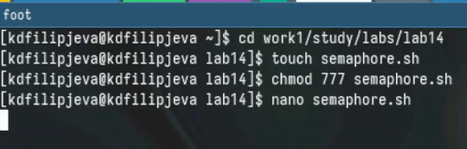{height=50%}

## Код в файле

Код для первого задания

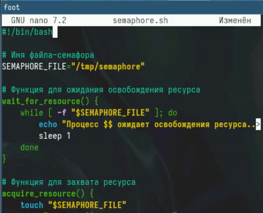{height=50%}

## Активация кода

Активация кода и захват процесса

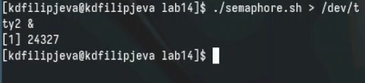{height=50%}

## Работоспособность кода

Активация кода во второй консоли, где он захватывается повторно, используется и высвобождается

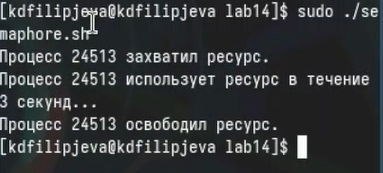{height=50%}

## Не баг, а фича

Автоматическое завершение процесса при очистке терминала

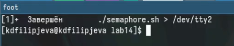{height=50%}

## Создание файла

Создадим файл для второго задания и выдадим ему права

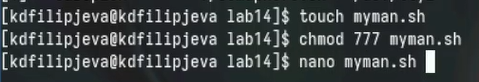{height=50%}

## Код в файле

Впишем необходимый код

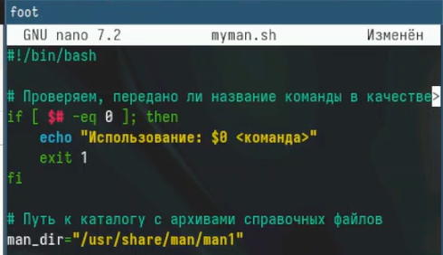{height=50%}

## Работоспособность кода

Активируем код для команды *ls*

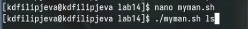{height=50%}

## Вывод кода

Вывод активированного кода для команды *ls*

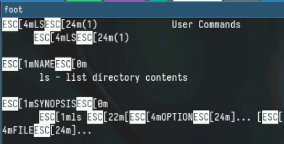{height=50%}

## Создание файла

Создадим файл для третьего задания

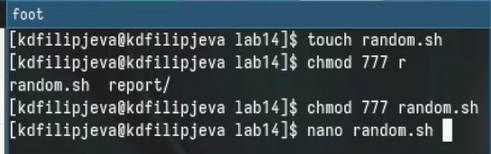{height=50%}

## Код в файле

Впишем необходимый нам код

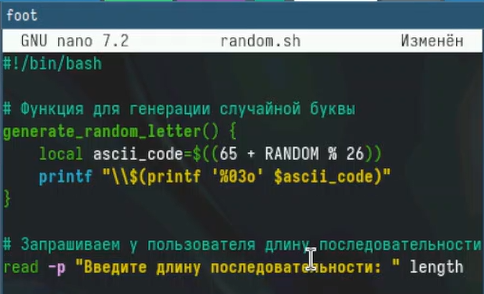{height=50%}

## Работоспособность кода

Проверка кода

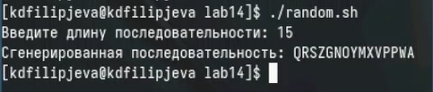{height=50%}

## Выводы

Мы получили новые и отработали у##е имеющиеся навыки программирования в оболочке OC Linux.

