---
## Front matter
title: "Отчет о прохождении первого модуля внешнего курса"
subtitle: "Введение в Linux. Модуль 1"
author: "Филипьева Ксения Дмитриевна"

## Generic otions
lang: ru-RU
toc-title: "Содержание"

## Bibliography
bibliography: bib/cite.bib
csl: pandoc/csl/gost-r-7-0-5-2008-numeric.csl

## Pdf output format
toc: true # Table of contents
toc-depth: 2
lof: true # List of figures
lot: true # List of tables
fontsize: 12pt
linestretch: 1.3
papersize: a4
documentclass: scrreprt
## I18n polyglossia
polyglossia-lang:
  name: russian
  options:
	- spelling=modern
	- babelshorthands=true
polyglossia-otherlangs:
  name: english
## I18n babel
babel-lang: russian
babel-otherlangs: english
## Fonts
mainfont: PT Serif
romanfont: PT Serif
sansfont: PT Sans
monofont: PT Mono
mainfontoptions: Ligatures=TeX
romanfontoptions: Ligatures=TeX
sansfontoptions: Ligatures=TeX,Scale=MatchLowercase
monofontoptions: Scale=MatchLowercase,Scale=0.9
## Biblatex
biblatex: true
biblio-style: "gost-numeric"
biblatexoptions:
  - parentracker=true
  - backend=biber
  - hyperref=auto
  - language=auto
  - autolang=other*
  - citestyle=gost-numeric
## Pandoc-crossref LaTeX customization
figureTitle: "Рис."
tableTitle: "Таблица"
listingTitle: "Листинг"
lofTitle: "Список иллюстраций"
lotTitle: "Список таблиц"
lolTitle: "Листинги"
## Misc options
indent: true
header-includes:
  - \usepackage{indentfirst}
  - \usepackage{float} # keep figures where there are in the text
  - \floatplacement{figure}{H} # keep figures where there are in the text
---

# Цель работы

Пройти курс, который дополнит уже имеющиеся и возможно даст новые знания.

# Выполнение лабораторной работы

В первом задании необходимо указать как называется курс - это делается с легкостью, ведь его название постоянно светится в левом блоке меню, где виден наш прогресс. (рис. [-@fig:1]).

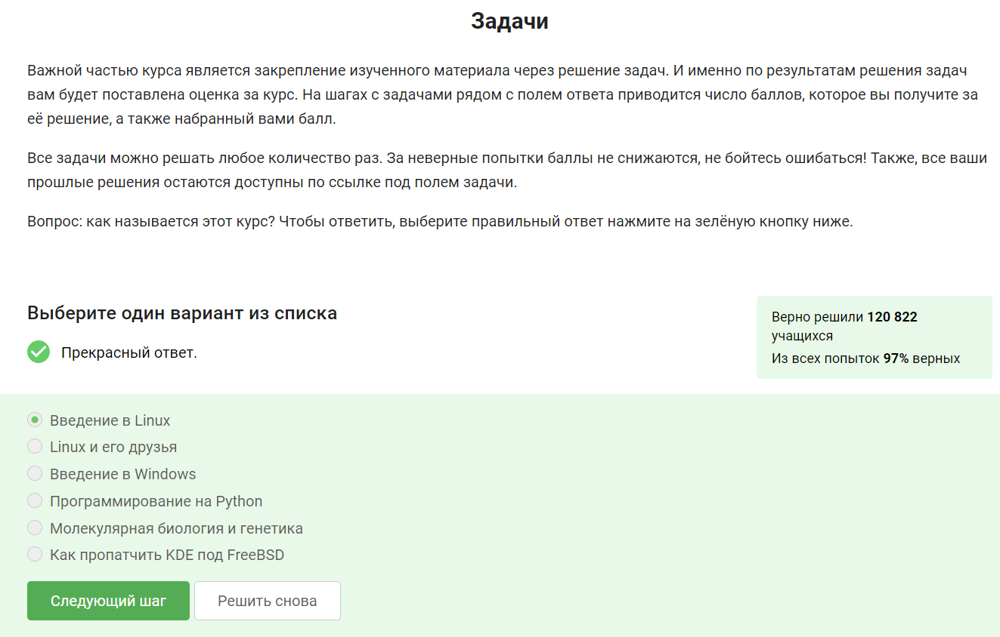{#fig:1 width=100%}

Здесь, прочитав критерии прохождения курса, необходимо отметить верные утверждения, с чем я успешно справляюсь. (рис. [-@fig:2]).

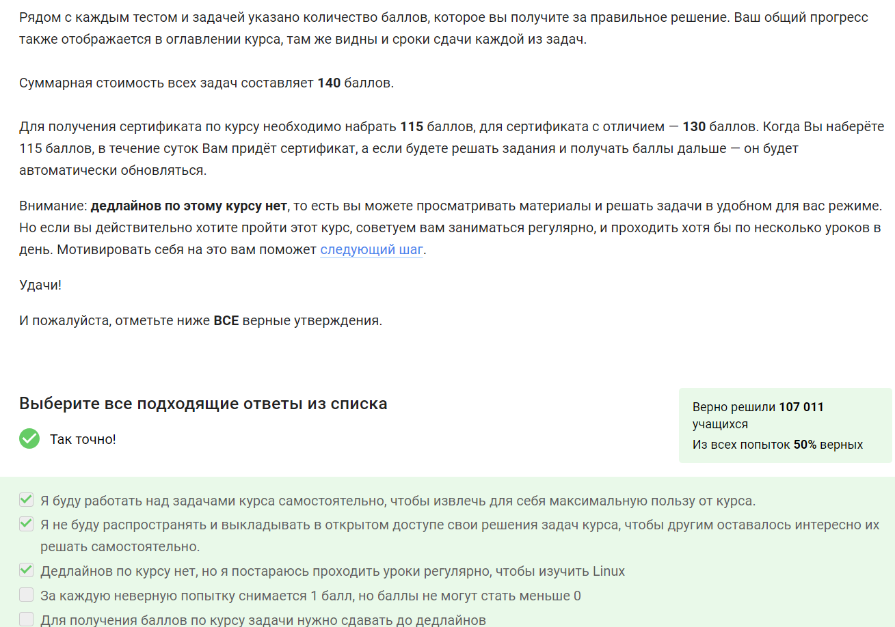{#fig:2 width=100%}

Здесь необходимо указать те ОС, которыми я чаще всего пользуюсь, это - OS X и Linux. (рис. [-@fig:3]).

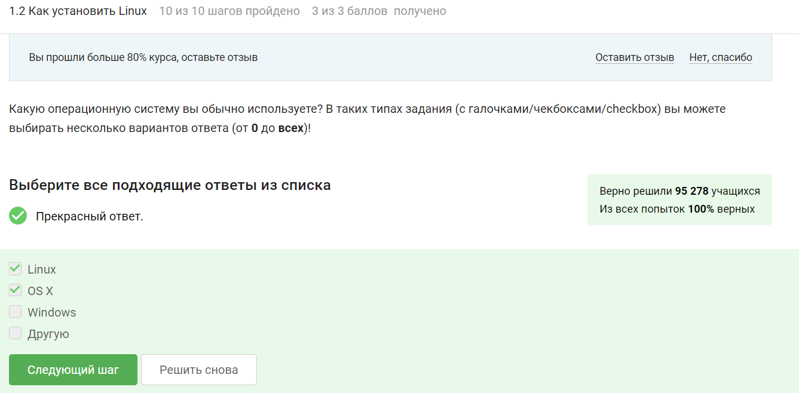{#fig:3 width=100%}

Здесь, поскольку мы уже второй семестр работаем с виртуальными машинами, проблем с ответом на вопрос не возникло, ведь это точно не автомобиль будущего. (рис. [-@fig:4]).

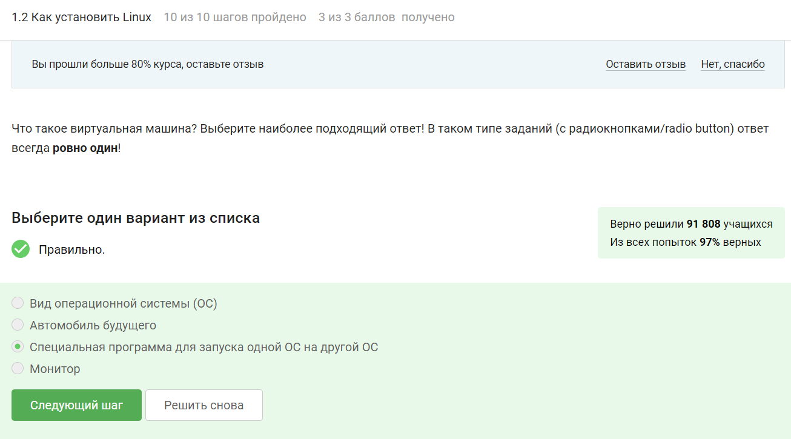{#fig:4 width=100%}

Здесь просто отмечаем о нашем успехе и идем дальше. (рис. [-@fig:5]).

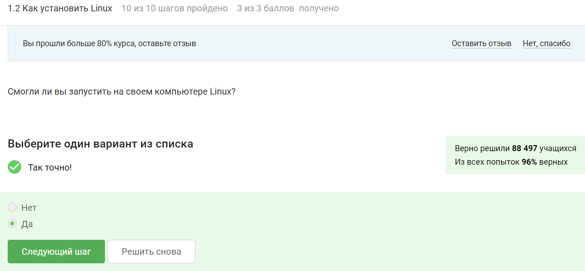{#fig:5 width=100%}

Вставляем файл, с тем расширением, что требовалось от нас. Создан он был через LibreOffice Writer. (рис. [-@fig:6]).

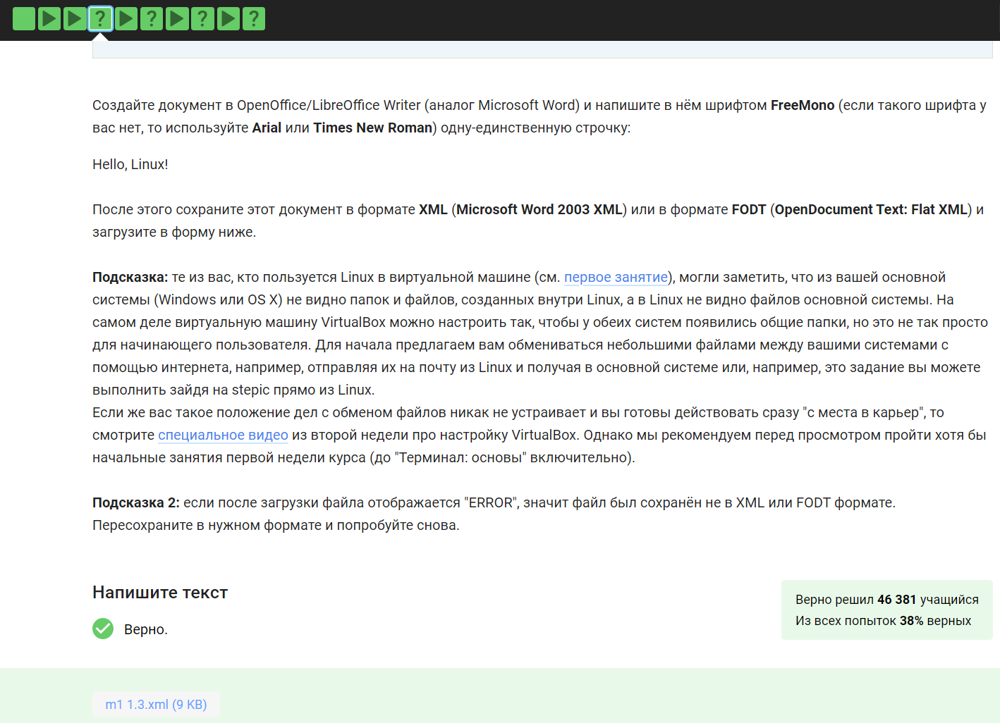{#fig:6 width=100%}

Отвечаем deb, поскольку установочные файлы действительно имеют такое расширение в Убунте. (рис. [-@fig:7]).

{#fig:7 width=100%}

Для этого задания необходимо было установить программу VLC, с чем мы успешно справились и вывели фамилию ее создателя. (рис. [-@fig:8]).

{#fig:8 width=100%}

Посмотрев видео, отвечаем на вопрос о том, для чего можно использовать Update Manager. (рис. [-@fig:9]).

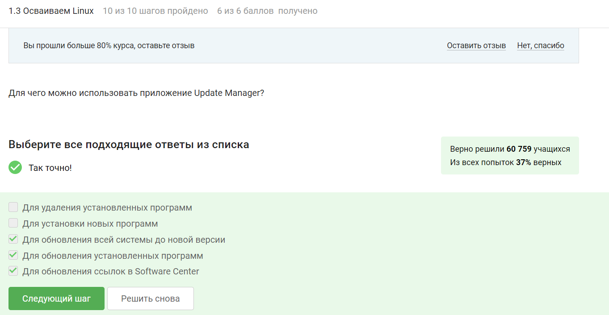{#fig:9 width=100%}

Как по мне, иных синонимов к командной строке, кроме консоли и терминала в принципе и не существует. (рис. [-@fig:10]).

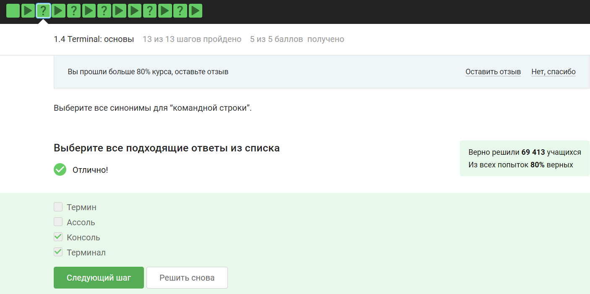{#fig:10 width=100%}

Здесь ответ очевиден, ведь терминал чувствителен к регистру, помимо этого остальных команд и не существует. (рис. [-@fig:11]).

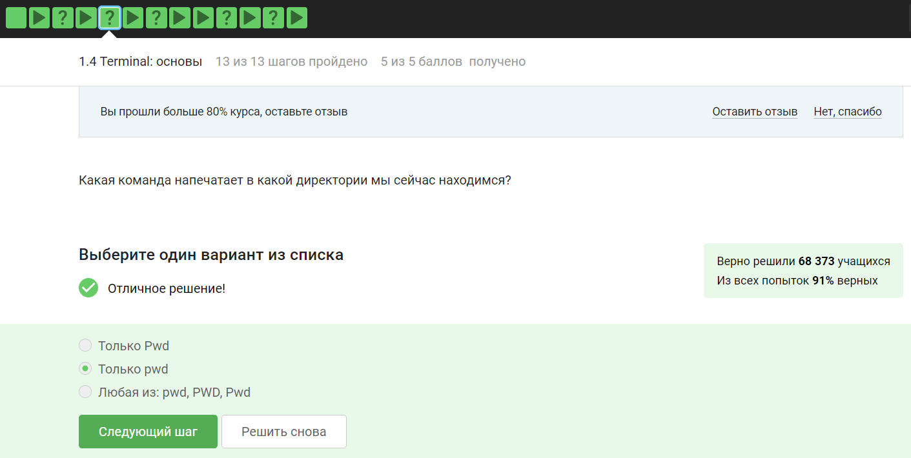{#fig:11 width=100%}

Чтобы с точностью выполнить это задание, необходимо было зайти на виртуальную машину и проверить функционал команды ls через man. (рис. [-@fig:12]).

{#fig:12 width=100%}

Здесь нам помогла информация о ls из прошлого задания. (рис. [-@fig:13]).

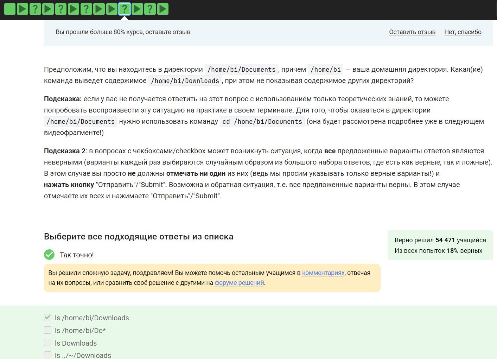{#fig:13 width=100%}

За удаление директорий отвечает команда rm, поэтому ее и выбираем. (рис. [-@fig:14]).

{#fig:14 width=100%}

Это было проверено на виртуальной машине, от того и было выбрано такое утверждение в качестве ответа. (рис. [-@fig:15]).

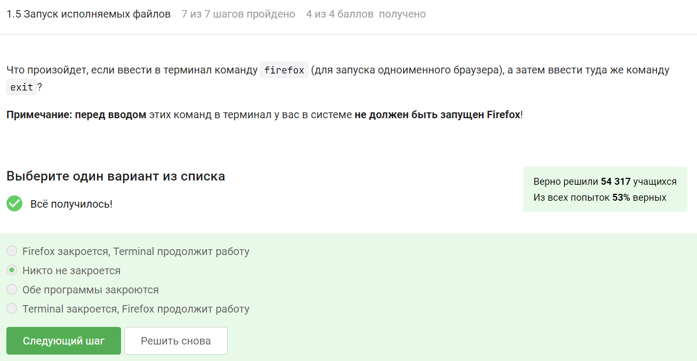{#fig:15 width=100%}

Запуск программы с амперсантом экивалентен запуску в фоновом режиме, что и означает bg. (рис. [-@fig:16]).

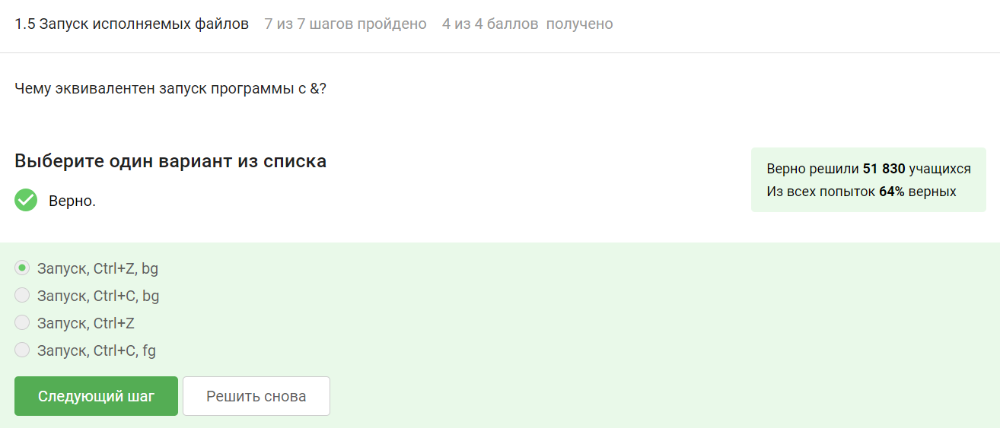{#fig:16 width=100%}

Файл был скачан, были выданы права через chmod и было получено то, что видно в поле ответа. (рис. [-@fig:17]).

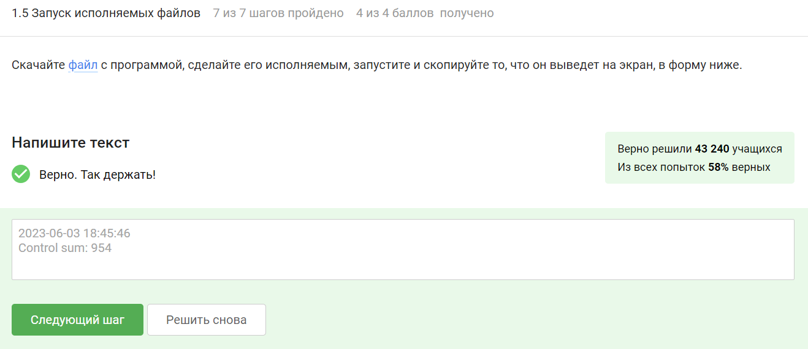{#fig:17 width=100%}

Ошибки выводятся прямо на экран, в терминале, что не единожды можно было заметить в процессе выполнения лабораторных работ. (рис. [-@fig:18]).

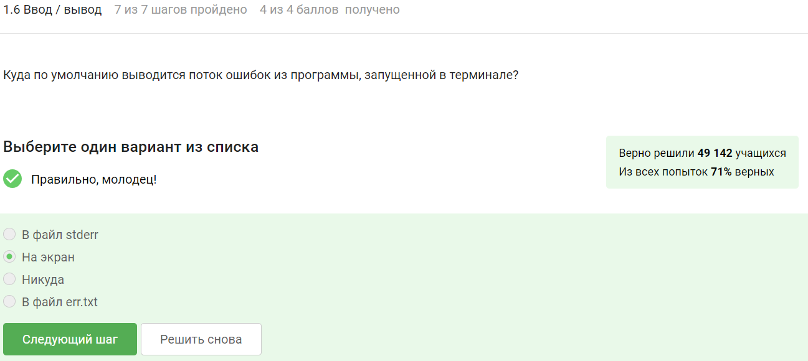{#fig:18 width=100%}

Цифра 2 обозначает вывод конкретно ошибок, а не всего потока данных, поэтому выбираем варианты с двойкой. (рис. [-@fig:19]).

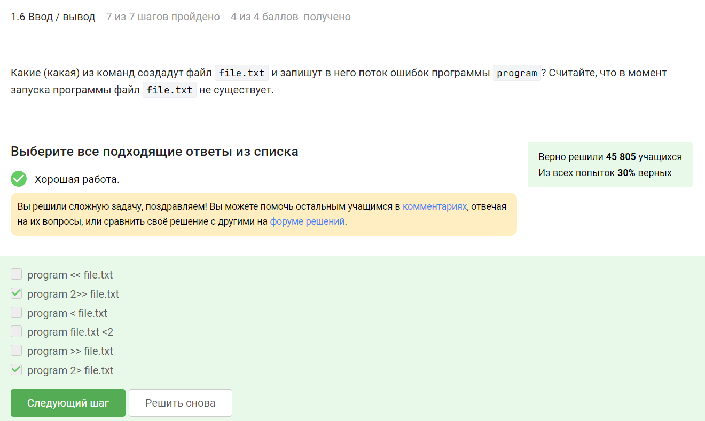{#fig:19 width=100%}

Если заранее не было указано файла куда выводятся ошибки, то они выводятся на экран, в не зависимости от того, одиночная это команда или их несколько, объединенных в конвеер. (рис. [-@fig:20]).

{#fig:20 width=100%}

Аргумент -0 скидывает указанные все предыдущие директории, поэтому файл сохраняется в ту, в которой мы находимся на данный момент. Также устанавливается имя 1.jpg, вместо example.jpg (рис. [-@fig:21]).

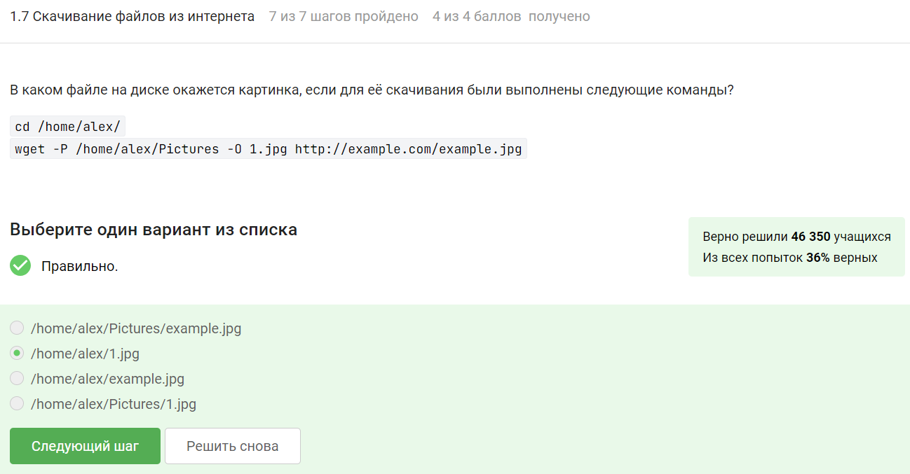{#fig:21 width=100%}

Посмотрев справку по комамнде, можем с точностью ответить, что верный аргумент - quiet (рис. [-@fig:22]).

{#fig:22 width=100%}

Для выполнения этого задания простой справки по команде было недостаточно, поэтому пришлось посетить сайт разработчиков и посмотреть полное ее описание там. (рис. [-@fig:23]).

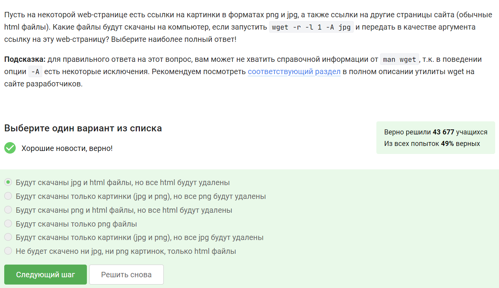{#fig:23 width=100%}

Комментарии излишни, на скриншоте все видно. (рис. [-@fig:24]).

{#fig:24 width=100%}

gzip нам просто не друг, поэтому мы будем использовать только zip и tar. (рис. [-@fig:25]).

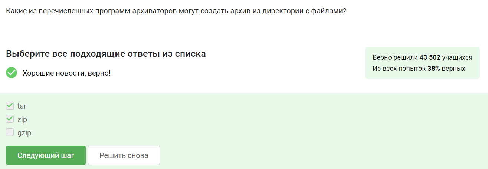{#fig:25 width=100%}

Для выполнения этого задания опять пришлось обратиться к справке по команде, чтобы получить точный ответ. (рис. [-@fig:26]).

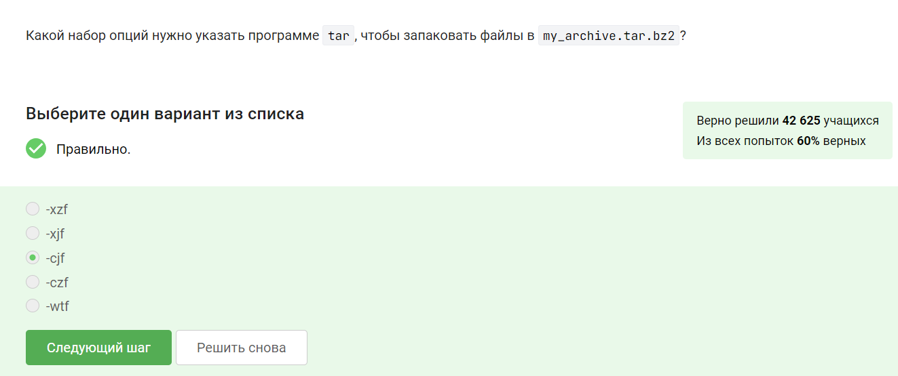{#fig:26 width=100%}

Неотмеченные маски будут работать, но не подойдут для нашего файла. (рис. [-@fig:27]).

{#fig:27 width=100%}

Здесь необходимо было выбрать все варианты, в которых содержалось строго "world". (рис. [-@fig:28]).

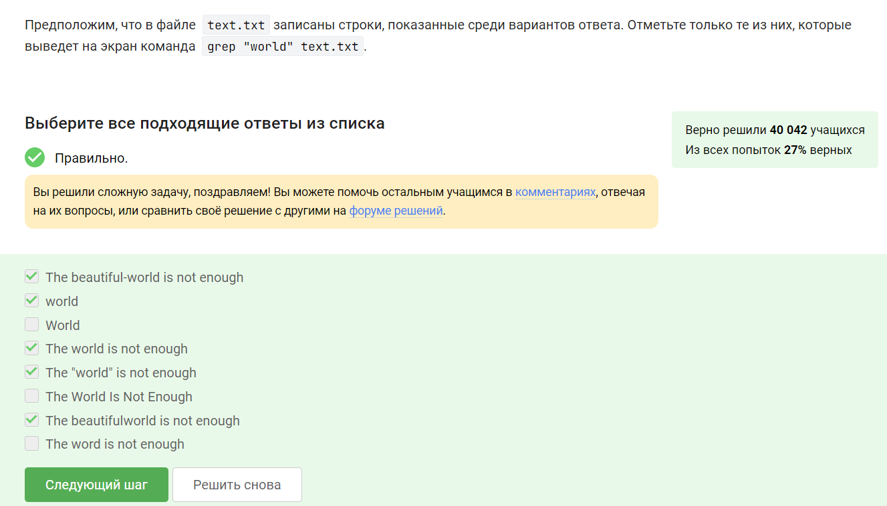{#fig:28 width=100%}

Ну тут мы просто прикрепили качественно оформленный файлик и все зачлось. (рис. [-@fig:29]).

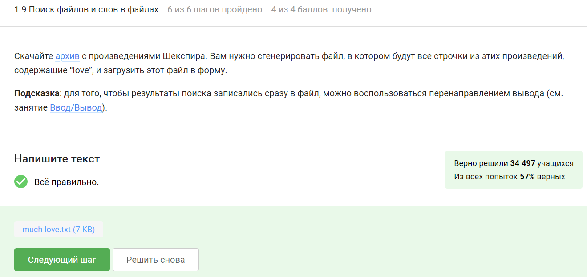{#fig:29 width=100%}

# Выводы

Мы прошли первый модуль внешнего курса "Введение в Linux" и освежили уже имеющиеся знания, а также получили некоторые новые.

