---
## Front matter
title: "Отчет о прохождении первого модуля внешнего курса"
subtitle: "Введение в Linux. Модуль 2"
author: "Филипьева Ксения Дмитриевна"

## Generic otions
lang: ru-RU
toc-title: "Содержание"

## Bibliography
bibliography: bib/cite.bib
csl: pandoc/csl/gost-r-7-0-5-2008-numeric.csl

## Pdf output format
toc: true # Table of contents
toc-depth: 2
lof: true # List of figures
lot: true # List of tables
fontsize: 12pt
linestretch: 1.3
papersize: a4
documentclass: scrreprt
## I18n polyglossia
polyglossia-lang:
  name: russian
  options:
	- spelling=modern
	- babelshorthands=true
polyglossia-otherlangs:
  name: english
## I18n babel
babel-lang: russian
babel-otherlangs: english
## Fonts
mainfont: PT Serif
romanfont: PT Serif
sansfont: PT Sans
monofont: PT Mono
mainfontoptions: Ligatures=TeX
romanfontoptions: Ligatures=TeX
sansfontoptions: Ligatures=TeX,Scale=MatchLowercase
monofontoptions: Scale=MatchLowercase,Scale=0.9
## Biblatex
biblatex: true
biblio-style: "gost-numeric"
biblatexoptions:
  - parentracker=true
  - backend=biber
  - hyperref=auto
  - language=auto
  - autolang=other*
  - citestyle=gost-numeric
## Pandoc-crossref LaTeX customization
figureTitle: "Рис."
tableTitle: "Таблица"
listingTitle: "Листинг"
lofTitle: "Список иллюстраций"
lotTitle: "Список таблиц"
lolTitle: "Листинги"
## Misc options
indent: true
header-includes:
  - \usepackage{indentfirst}
  - \usepackage{float} # keep figures where there are in the text
  - \floatplacement{figure}{H} # keep figures where there are in the text
---

# Цель работы

Пройти курс, который дополнит уже имеющиеся и возможно даст новые знания.

# Выполнение лабораторной работы

Удаленный сервер уникальная вещь, поэтому может быть использован для практически любых задач. (рис. [-@fig:1]).

{#fig:1 width=100%}

Ключ имеет расширение pub от public, что изначально подразумевает, что ключ является публичным (рис. [-@fig:2]).

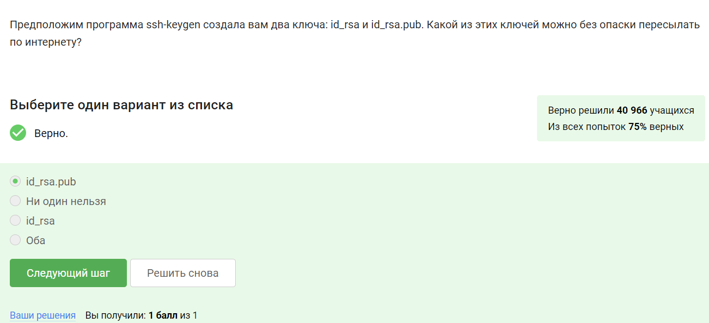{#fig:2 width=100%}

Посмотрев видео перед заданием, мне удалось успешно его выполнить (рис. [-@fig:3]).

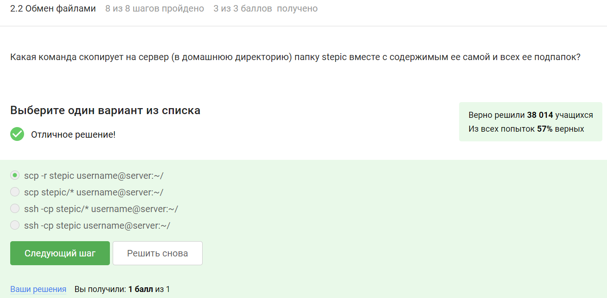{#fig:3 width=100%}

Из банального: либо нет интернета, либо программа уже установлена, и нет возможности установить ее повторно, тогда придется использовать sudo apt-get update. (рис. [-@fig:4]).

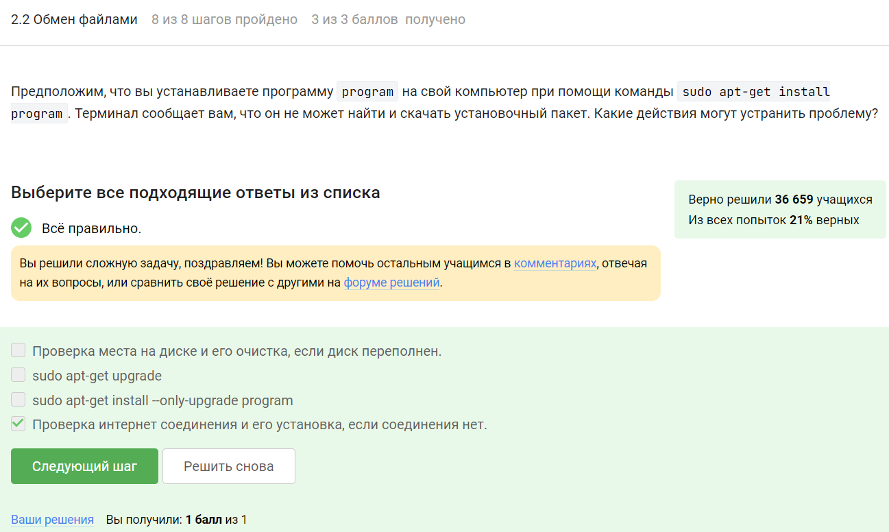{#fig:4 width=100%}

Данную программу можно использовать практически для чего угодно, кроме установки программ на сервер. (рис. [-@fig:5]).

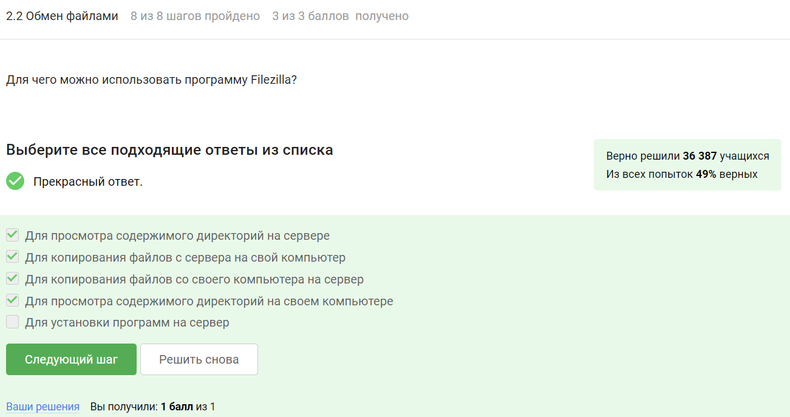{#fig:5 width=100%}

Запускать на своем компьютере - путь слабаков, а чтобы ничего нельзя было сделать - такой ситуации не существует, я думаю. (рис. [-@fig:6]).

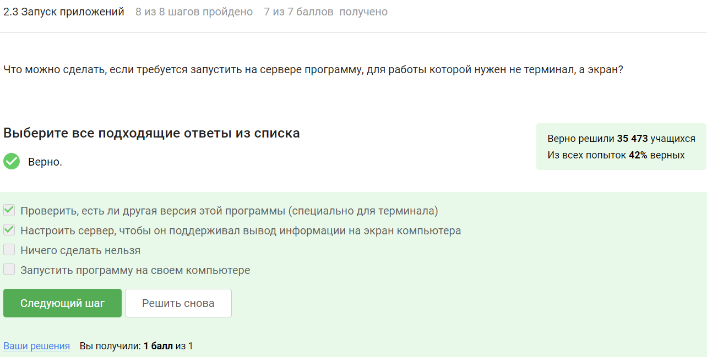{#fig:6 width=100%}

Это самые стандартные способы узнать справку о программе, поэтому их и выбираем. (рис. [-@fig:7]).

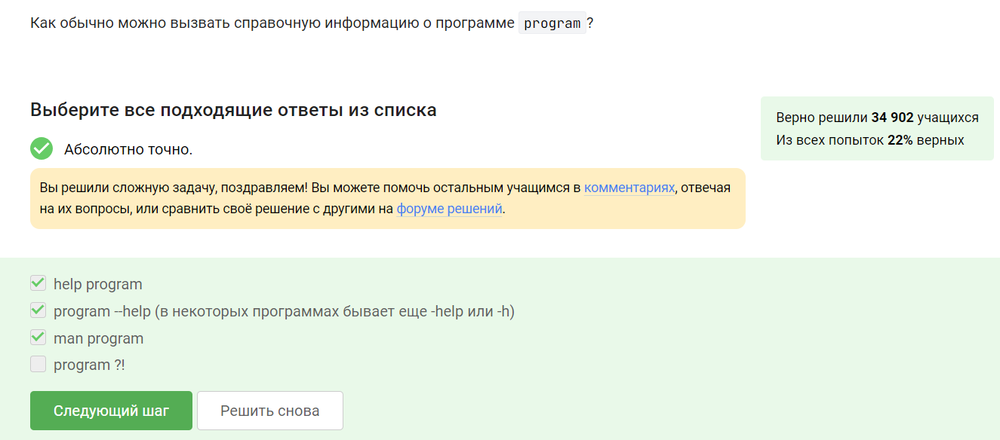{#fig:7 width=100%}

Изучив справку для FastQC, я получила форматы, с которыми она может работать. (рис. [-@fig:8]).

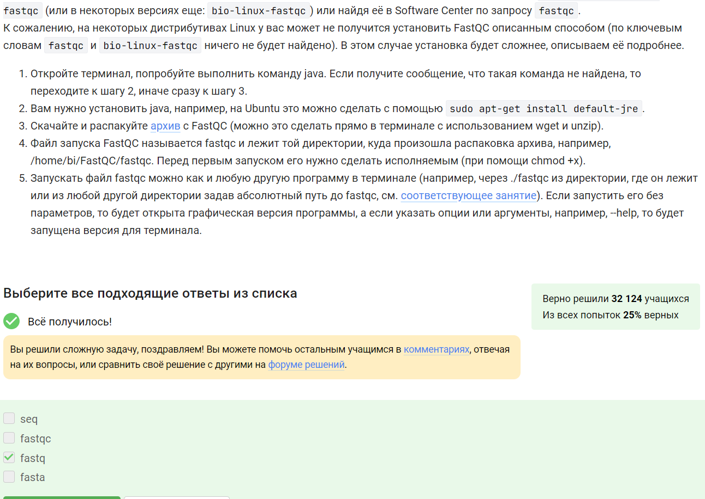{#fig:8 width=100%}

Посмотрев справку, мне удалось сформировать команду, которая поможет в поставленной задаче. (рис. [-@fig:9]).

{#fig:9 width=100%}

Для достоверности была воспроизведена такая же ситуация на моей виртуальной машине. (рис. [-@fig:10]).

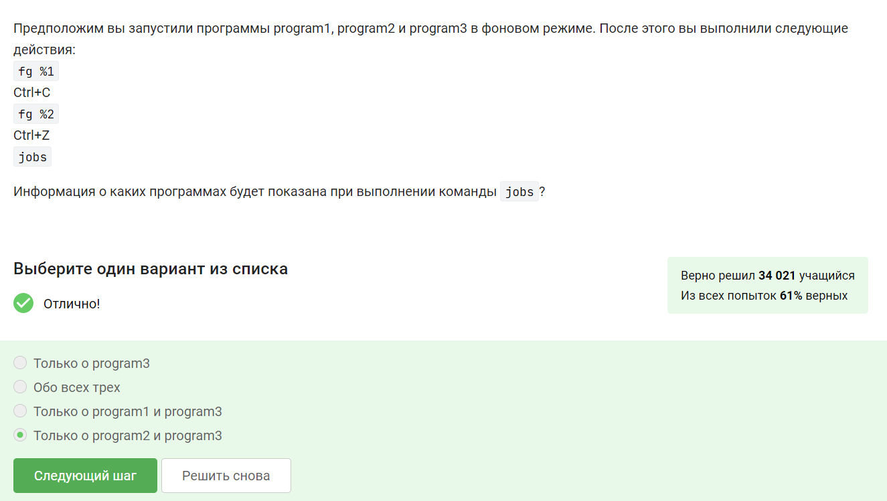{#fig:10 width=100%}

Информация была получена из справки по команде kill. (рис. [-@fig:11]).

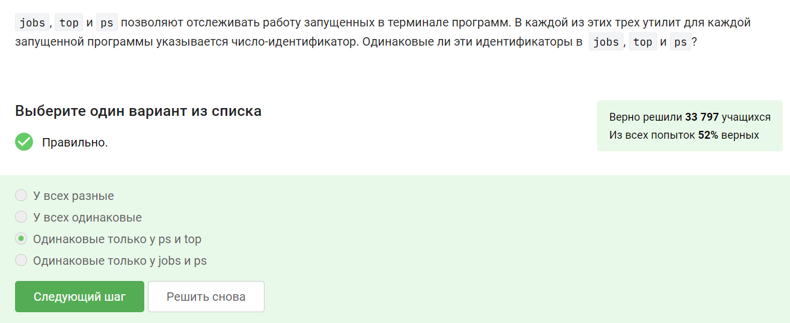{#fig:11 width=100%}

Выявлено практическим путём. (рис. [-@fig:12]).

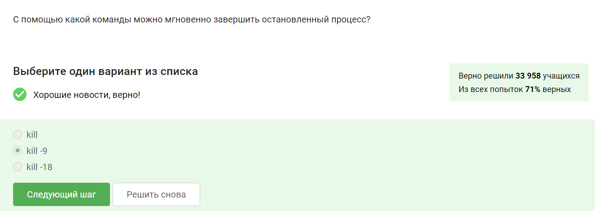{#fig:12 width=100%}

Это было также выявлено практическим путём. (рис. [-@fig:13]).

{#fig:13 width=100%}

Такое приложение использует только память, чтобы оставаться в фоне, что будет показано в следующем задании. Поэтому процессор никаким образом не будет загружен этим приложением. (рис. [-@fig:14]).

{#fig:14 width=100%}

Подтверждение предыдущему пояснению. (рис. [-@fig:15]).

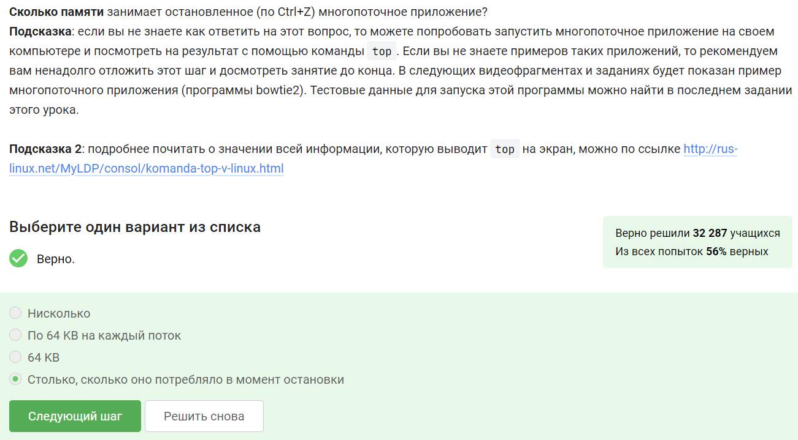{#fig:15 width=100%}

Отдельный поток многопоточного приложения остановить не получится. (рис. [-@fig:16]).

{#fig:16 width=100%}

Изучено практическим путём. (рис. [-@fig:17]).

{#fig:17 width=100%}

Код программы был получен практическим путём. (рис. [-@fig:18]).

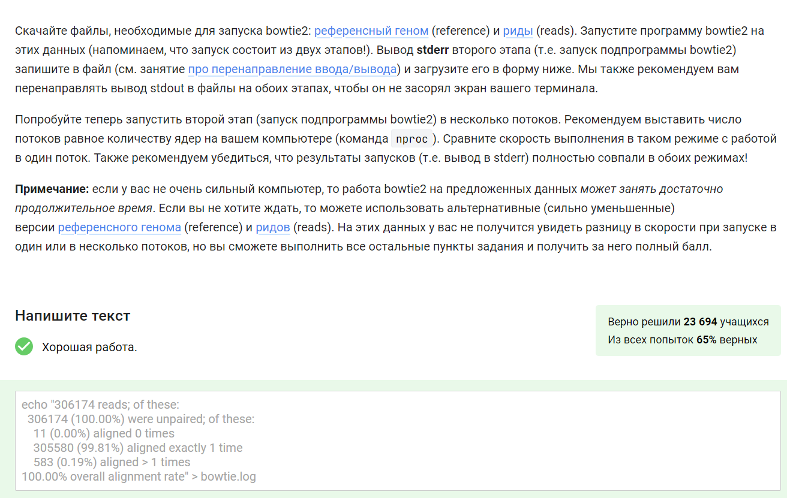{#fig:18 width=100%}

Ответ был получен также практическим путём. (рис. [-@fig:19]).

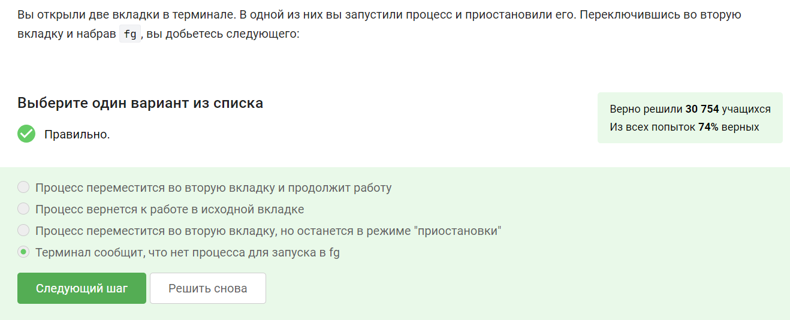{#fig:19 width=100%}

Ответ всё еще был получен практическим путём. (рис. [-@fig:20]).

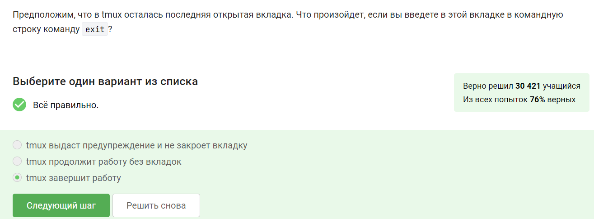{#fig:20 width=100%}

Информация, найденная в интернете и подкрепленная практическим путём. (рис. [-@fig:21]).

{#fig:21 width=100%}

Ответ получен практическим путём. (рис. [-@fig:22]).

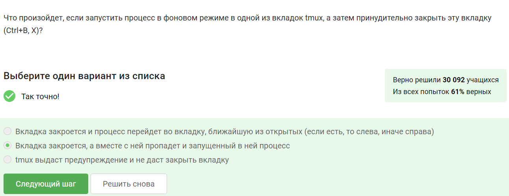{#fig:22 width=100%}

Изучив справку по команде, был получен ответ. (рис. [-@fig:23]).

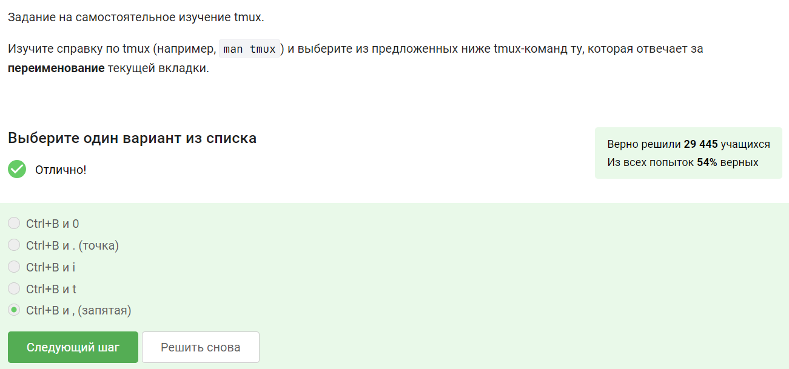{#fig:23 width=100%}

Как и предыдущее задание - ответ был получен после изучения справки по команде. (рис. [-@fig:24]).

{#fig:24 width=100%}

# Выводы

Мы прошли второй модуль внешнего курса "Введение в Linux" и освежили уже имеющиеся знания, а также получили некоторые новые.

