---
## Front matter
lang: ru-RU
title: Индивидуальный проект. Стадия 4.
subtitle: Презентация
author:
  - Филипьева К.Д.
institute:
  - Российский университет дружбы народов, Москва, Россия
date: 27 апреля 2024

## i18n babel
babel-lang: russian
babel-otherlangs: english

## Formatting pdf
toc: false
toc-title: Содержание
slide_level: 2
aspectratio: 169
section-titles: true
theme: metropolis
header-includes:
 - \metroset{progressbar=frametitle,sectionpage=progressbar,numbering=fraction}
 - '\makeatletter'
 - '\beamer@ignorenonframefalse'
 - '\makeatother'
 
## Fonts
mainfont: PT Serif
romanfont: PT Serif
sansfont: PT Sans
monofont: PT Mono
mainfontoptions: Ligatures=TeX
romanfontoptions: Ligatures=TeX
sansfontoptions: Ligatures=TeX,Scale=MatchLowercase
monofontoptions: Scale=MatchLowercase,Scale=0.9
---

# Информация

## Докладчик

:::::::::::::: {.columns align=center}
::: {.column width="70%"}

  * Филипьева Ксения Дмитриевна
  * Студент
  * Российский университет дружбы народов
  * [1132230795@pfur.ru](mailto:1132230795@pfur.ru)

:::
::: {.column width="30%"}

:::
::::::::::::::

## Цель

Выполнение 4 стадии индивидуального проекта, где необходимо дополнить к уже имеющейся информации ссылки на сервисы, где имеется аккаунт. А также написать пост о прошедшей неделе и пост на выбор.

## Пост на выбор

Написанный пост на выбор, на тему "Отчёт в Markdown"

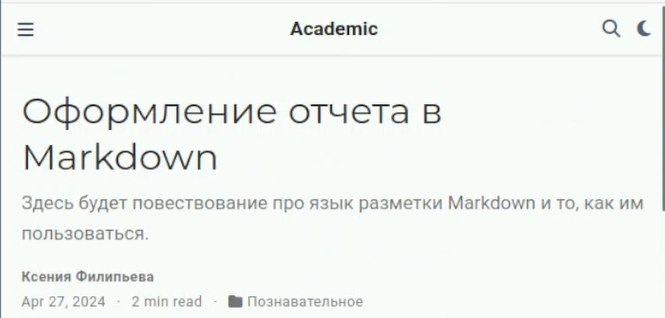{height=50%}

## Пост о прошедшей неделе

Пост о прошедшей неделе

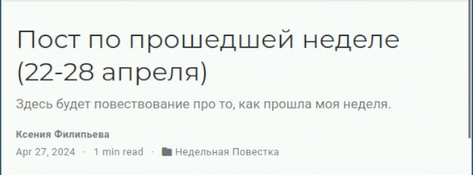{height=50%}

## Ссылки в Markdown

Ссылки на ресурсы в маркдауне

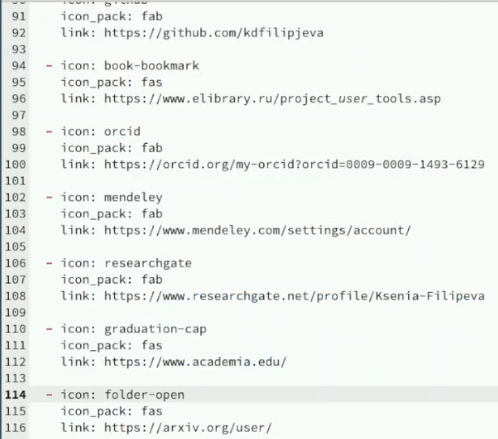{height=50%}

## Ссылки на сайте

Ссылки на ресурсе в сайте

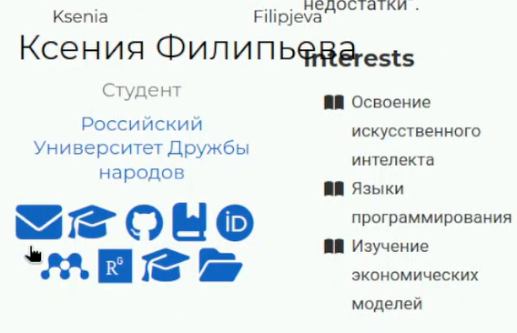{height=50%}

## E-mail

Письмо на электронную почту

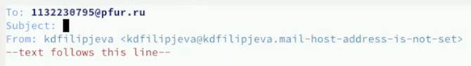{height=50%}

## Google Scholar

Аккаунт в Google Scholar

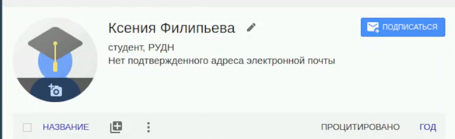{height=50%}

## Github

Аккаунт в Github

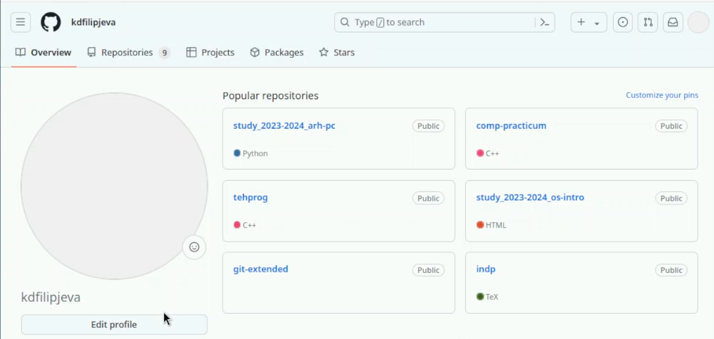{height=50%}

## eLibrary

Аккаунт в eLibrary

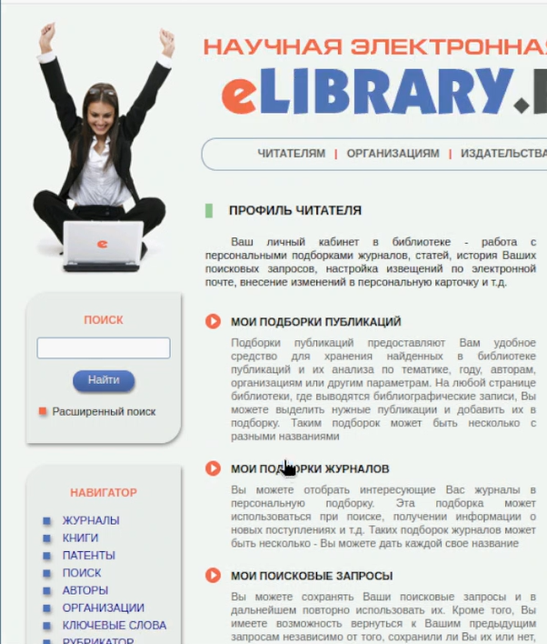{height=50%}

## ORCID

Аккаунт в ORCID

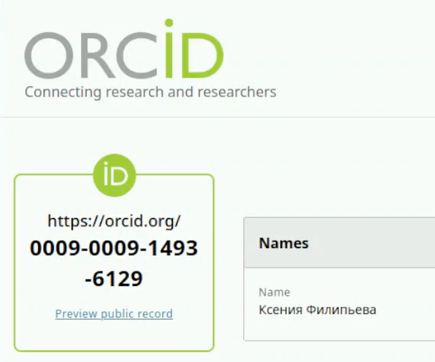{height=50%}

## Mendeley

Аккаунт в Mendeley

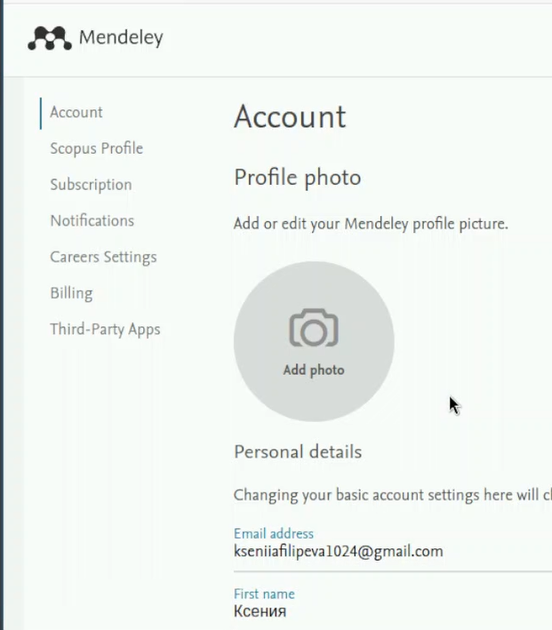{height=50%}

## Research Gate

Аккаунт в Research Gate

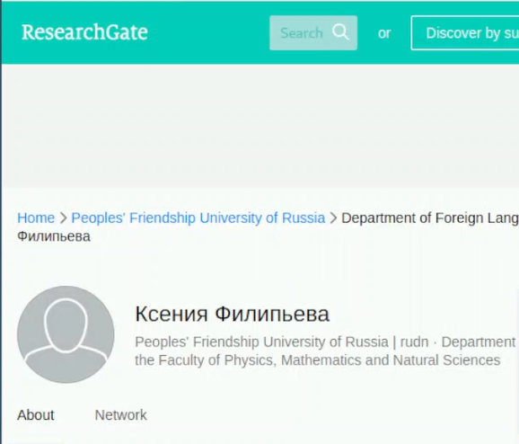{height=50%}

## Academia.edu

Аккаунт в Academia.edu

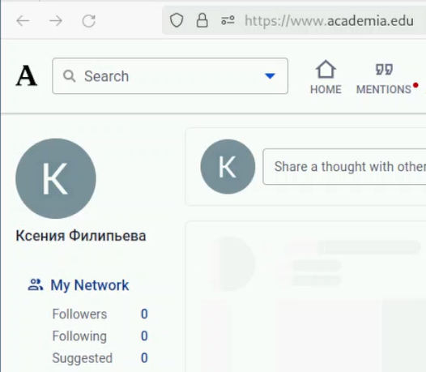{height=50%}

## arXiv

Аккаунт в arXiv

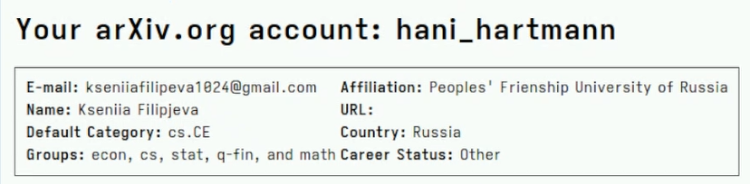{height=50%}

## Выводы

Мы дополнили уже имеющуюся информацию о нас на сайте ссылками на имеющиеся ресурсы.

