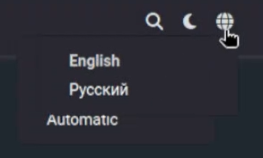

---
## Front matter
lang: ru-RU
title: Индивидуальный проект. Стадия 6.
subtitle: Презентация
author:
  - Филипьева К.Д.
institute:
  - Российский университет дружбы народов, Москва, Россия
date: 25 мая 2024

## i18n babel
babel-lang: russian
babel-otherlangs: english

## Formatting pdf
toc: false
toc-title: Содержание
slide_level: 2
aspectratio: 169
section-titles: true
theme: metropolis
header-includes:
 - \metroset{progressbar=frametitle,sectionpage=progressbar,numbering=fraction}
 - '\makeatletter'
 - '\beamer@ignorenonframefalse'
 - '\makeatother'
 
## Fonts
mainfont: PT Serif
romanfont: PT Serif
sansfont: PT Sans
monofont: PT Mono
mainfontoptions: Ligatures=TeX
romanfontoptions: Ligatures=TeX
sansfontoptions: Ligatures=TeX,Scale=MatchLowercase
monofontoptions: Scale=MatchLowercase,Scale=0.9
---

# Информация

## Докладчик

:::::::::::::: {.columns align=center}
::: {.column width="70%"}

  * Филипьева Ксения Дмитриевна
  * Студент
  * Российский университет дружбы народов
  * [1132230795@pfur.ru](mailto:1132230795@pfur.ru)

:::
::: {.column width="30%"}

:::
::::::::::::::

## Цель

Выполнение 6 стадии индивидуального проекта, в которой нам необходимо сделать сайт би-язычным.

## Выполнение проекта
На этих скриншотах видны все материалы сайта, переведенные на английский язык, реализация переключателя языков, а также пост по прошедшей неделе и пост на выбор(т.к. тем в туисе предоставлено не было, то я сделала на пожелавшуюся мне) 

## 
{ height=50%}

##
{ height=50%}

##
{ height=50%}

##
{ height=50%}

##
{ height=50%}

##
{ height=50%}

##
{ height=50%}

##
{ height=50%}

##
{ height=50%}

##
{ height=50%}

##
{ height=50%}

##
{ height=50%}

##
{ height=50%}

##
{ height=50%}

##
{ height=50%}

##
{ height=50%}

##
{ height=50%}

## Выводы

Мы сделали сайт доступным на двух языках.
