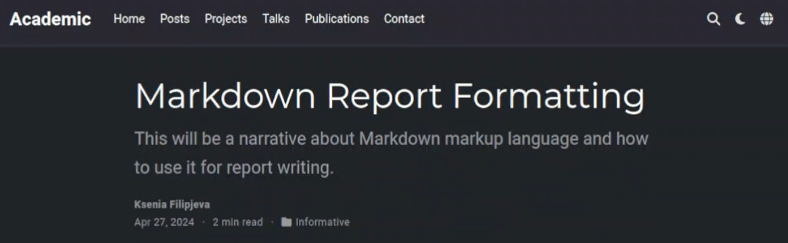
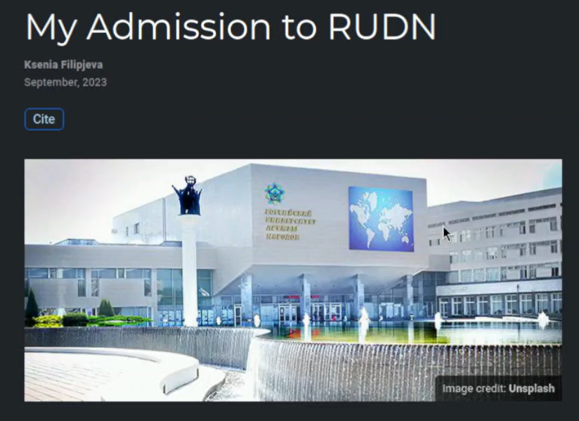

---
## Front matter
title: "Отчёт по индивидуальному проекту"
subtitle: "Стадия 6"
author: "Филипьева Ксения Дмитриевна"

## Generic otions
lang: ru-RU
toc-title: "Содержание"

## Bibliography
bibliography: bib/cite.bib
csl: pandoc/csl/gost-r-7-0-5-2008-numeric.csl

## Pdf output format
toc: true # Table of contents
toc-depth: 2
lof: true # List of figures
lot: true # List of tables
fontsize: 12pt
linestretch: 1.5
papersize: a4
documentclass: scrreprt
## I18n polyglossia
polyglossia-lang:
  name: russian
  options:
	- spelling=modern
	- babelshorthands=true
polyglossia-otherlangs:
  name: english
## I18n babel
babel-lang: russian
babel-otherlangs: english
## Fonts
mainfont: PT Serif
romanfont: PT Serif
sansfont: PT Sans
monofont: PT Mono
mainfontoptions: Ligatures=TeX
romanfontoptions: Ligatures=TeX
sansfontoptions: Ligatures=TeX,Scale=MatchLowercase
monofontoptions: Scale=MatchLowercase,Scale=0.9
## Biblatex
biblatex: true
biblio-style: "gost-numeric"
biblatexoptions:
  - parentracker=true
  - backend=biber
  - hyperref=auto
  - language=auto
  - autolang=other*
  - citestyle=gost-numeric
## Pandoc-crossref LaTeX customization
figureTitle: "Рис."
tableTitle: "Таблица"
listingTitle: "Листинг"
lofTitle: "Список иллюстраций"
lotTitle: "Список таблиц"
lolTitle: "Листинги"
## Misc options
indent: true
header-includes:
  - \usepackage{indentfirst}
  - \usepackage{float} # keep figures where there are in the text
  - \floatplacement{figure}{H} # keep figures where there are in the text
---

# Цель работы

Выполнение 6 стадии индивидуального проекта, где необходимо сделать поддержку двух языков на сайте.

# Выполнение лабораторной работы

На этих скриншотах видны все материалы сайта, переведенные на английский язык, реализация переключателя языков, а также пост по прошедшей неделе и пост на выбор(т.к. тем в туисе предоставлено не было, то я сделала на пожелавшуюся мне) (рис. [-@fig:1]) (рис. [-@fig:2]) (рис. [-@fig:3]) (рис. [-@fig:4]) (рис. [-@fig:5]) (рис. [-@fig:6]) (рис. [-@fig:7]) (рис. [-@fig:8]) (рис. [-@fig:9]) (рис. [-@fig:10]) (рис. [-@fig:11]) (рис. [-@fig:12]) (рис. [-@fig:13]) (рис. [-@fig:14]) (рис. [-@fig:15]) (рис. [-@fig:16]) (рис. [-@fig:17]) 

{#fig:1 width=100%}

{#fig:2 width=100%}

{#fig:3 width=100%}

{#fig:4 width=100%}

{#fig:5 width=100%}

{#fig:6 width=100%}

{#fig:7 width=100%}

{#fig:8 width=100%}

{#fig:9 width=100%}

{#fig:10 width=100%}

{#fig:11 width=100%}

{#fig:12 width=100%}

{#fig:13 width=100%}

{#fig:14 width=100%}

{#fig:15 width=100%}

{#fig:16 width=100%}

{#fig:17 width=100%}

# Выводы

Мы сделали наш сайт двухязычным - на русском и на английском языках.

